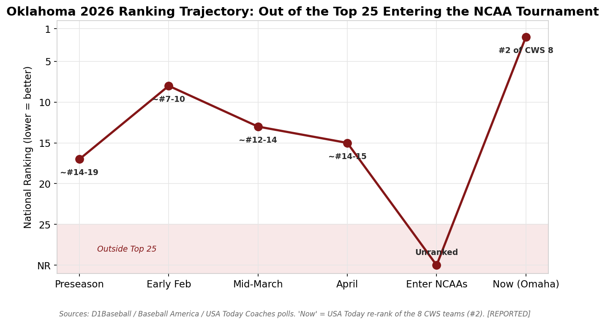
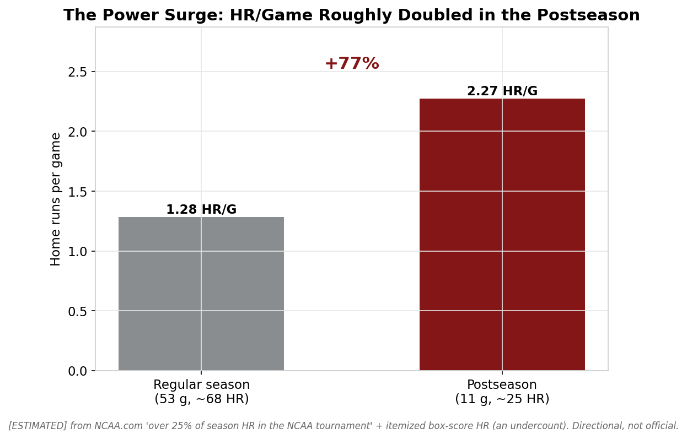
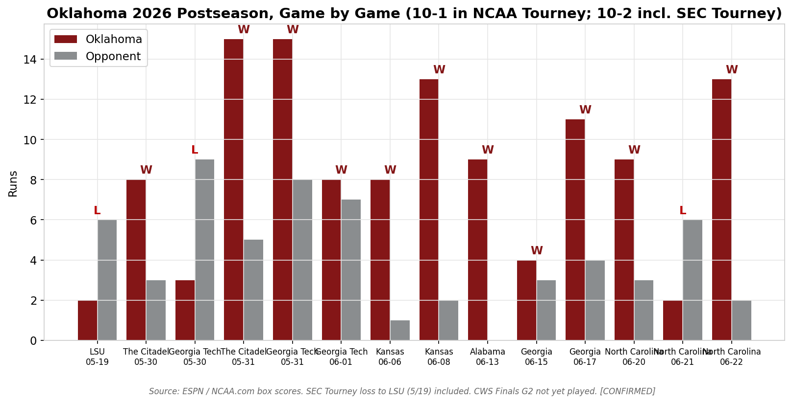

# Why Did the 2026 Oklahoma Sooners Make a Deep College World Series Run?

> A reproducible, fully-sourced data-science investigation that separates **sustainable team strength** from a **postseason hot streak** — using only public college-baseball data, with every figure tagged for confidence and nothing fabricated.


-success)


---

## Project overview

In June 2026, an **unranked, unseeded Oklahoma team that finished 14–16 in the SEC** reached the College World Series Finals, beating the No. 2, No. 7, and No. 3 national seeds along the way. This project gathers the public data behind that run, builds a tagged dataset and chart suite, and answers — with evidence — *why it happened* and *how much of it is repeatable.*

It is built to a strict standard: **verification-first, cite-or-flag, and no invented numbers.** College baseball lacks most sabermetric advanced stats; where a metric doesn't exist, this repo says so rather than guessing.

## Research question

> **Why did the 2026 Oklahoma Sooners make a deep NCAA Tournament run and reach the CWS Finals despite not being a national favorite — and was it sustainable team strength, a timed hot streak, favorable matchups, or a combination?**

## Repository structure

```
oklahoma-2026-cws-research/
├── README.md                         # you are here
├── PORTFOLIO_CASE_STUDY.md           # the case-study writeup
├── CHANGELOG.md                      # versioned research-iteration history (v0.9 → v1.5)
├── .github/workflows/ci.yml          # CI: validate + full build on every push
├── Makefile / run_analysis.sh        # one-command reproduction
├── requirements.txt
├── build_manifest.json               # deterministic build snapshot (checksums)
├── data/                             # 28 CSVs + data dictionary  (data/README.md)
├── charts/                           # 25 PNGs + make_charts.py   (charts/README.md)
├── report/                           # main report + FUTURE OUTLOOK (report/README.md)
├── audit/                            # skeptical gap audit + data sprint
├── distribution/                     # launch/distribution strategy
├── softball/                         # OU SOFTBALL dynasty module (9 datasets, own report)
├── championships/                    # OU ALL-SPORTS national titles (46 across 7 sports)
├── scripts/
│   ├── validate_data.py              # schema/integrity/provenance validator
│   ├── championship_analysis.py      # Phase 11 similarity models
│   ├── gamelog_market_analysis.py    # Phase 12 splits / luck / ratings / market
│   ├── championship_model.py         # Phase 13 logistic / PCA / k-means / Monte Carlo
│   ├── p2_advanced.py                # Phase 14 opponent adj / luck / betting / innings
│   └── build_report_assets.py        # validate → charts → manifest
├── sources/source_log.md             # every source, what it supports, tier
└── methodology/confidence_framework.md
```

## Data sources

All data is public and cited in [`sources/source_log.md`](sources/source_log.md). The spine:
- **Official OU cumulative statistics PDF** (as of 2026-06-20) — team, individual & fielding lines.
- **ESPN / NCAA.com box scores** — every postseason game.
- **WarrenNolan / NCAA.com** — RPI, strength of schedule, seeding.
- **Baseball America, OU Daily, SI, ESPN, Yahoo, CBS, On3** — context, quotes, recaps.

Nothing is recalled from model memory (the 2026 postseason post-dates the analyst model's training cutoff); every figure was pulled live.

## Methodology

1. **Premise verification** before analysis.
2. **Parallel direct data pulls** (official lines / box scores / résumé).
3. **Adversarial verification** — a 109-agent deep-research pass extracted 81 falsifiable claims, verified 25 under 3-vote review (**22 confirmed, 3 refuted-and-excluded**).
4. **Confidence tagging** on every figure: `CONFIRMED` / `REPORTED` / `ESTIMATED` / `NOT AVAILABLE`.
5. **Automated data validation** (`scripts/validate_data.py`) on every commit-worthy change.

Full framework: [`methodology/confidence_framework.md`](methodology/confidence_framework.md).

## Key findings

1. **The team was underrated, not lucky.** RPI #24 at selection but the **#2 strength of schedule** nationally and a **+112 run differential**; the 14–16 SEC record was a schedule artifact. *[HIGH]*
2. **A real postseason power surge.** HR/game **roughly doubled**; OU hit **~45 HR in its last 20 games** and **>25% of season HRs in the NCAA Tournament**. *[HIGH on existence; ESTIMATED on magnitude]*
3. **Freshman LHP Cord Rager** rebuilt a rotation that lost its 2025 ace (Witherspoon): 7–3, 4.74, 94 K, a **7-inning shutout of Alabama**. *[HIGH]*
4. **Deiten Lachance's breakout** — from 0 HR in 31 games to 18, 1.039 OPS, a 2-HR Finals opener. *[HIGH]*
5. **A durable engine underneath:** .391 team OBP, 132 SB at 85%, a 10.4 K/9 staff, clean defense. *[HIGH]*
6. **The path was hard, not soft** — three top-7 national seeds beaten, by an average of **+6.4 runs**. *[HIGH]*
7. **Opponent-adjusted, OU was a top-5 team the seed underrated** (Phase 12). The postseason-updated **WarrenNolan ELO ranks OU #4** (vs. its #24 selection-day RPI) — but **still behind finals opponent UNC (#2)**. The June turnaround was also a *pitching* story (May 8.4 RA/G → June 2.9); by Pythagorean OU was **not** broadly lucky (+1–2 wins), though its **11-3 one-run record** is real close-game variance. The betting market **never made OU a favorite** (season open +6600 → finals +142). *[computed]*
8. **Survivorship-corrected, OU's title profile was a ~6–13% long shot** (Phase 13). Across all 40 CWS participants 2021–2025, champions barely separate from the field (model AUC 0.55 — the title is high-variance once in Omaha), and OU's archetype cluster (power bat + 4.94 ERA) produced **0 champions**. The deciding **Game 3 is ~a coin flip** (ELO OU ≈46%; the Game 2 loss swung it from ~70%).
9. **Opponent-adjusted, OU was good-not-elite** (Phase 14). Vs the 2026 NCAA Tournament field OU went just **19-17 (−0.2 run diff/G)** — its +112 overall margin came mostly from a **12-0 demolition of cupcakes**. Pythagorean says ~neutral season luck, but an **11-3 one-run record** shows real favorable close-game variance, and the **betting market underrated OU all run** (underdog in all 4 priced games, went 3-1).
10. **Historically, OU is the *underdog-champion* archetype** (Phase 11). Across a 21-champion database (2000–2025), OU's closest statistical match is **2022 Ole Miss** (an unseeded, 14–16-SEC power team that won it all), then 2008 Fresno State and 2021 Mississippi State. By a strength composite, only **~28% of past champions were statistically weaker** than OU, and its **4.94 team ERA would be the highest of any champion since 2000** — a flawed-but-dangerous profile that has, recently, won anyway. *[computed]*

**The verdict (analyst-estimated):** ≈ **55% sustainable strength / 35% timed hot streak / 10% matchups** — see report Part VI. **Historical archetype:** champion-capable underdog, statistical twin of 2022 Ole Miss — see report Phase 11.

## Visual examples


*Oklahoma fell out of every Top 25 entering the NCAA Tournament — then re-emerged in Omaha.*


*The postseason home-run rate roughly doubled (ESTIMATED, directional).*


*10–1 in the NCAA Tournament; wins by an average of +6.4 runs.*

(Full catalog: [`charts/README.md`](charts/README.md).)

## Reproduction

```bash
# 1. install deps
pip install -r requirements.txt        # or: make install

# 2. reproduce everything (validate datasets → regenerate charts → manifest)
make all                               # or: ./run_analysis.sh

# just validate the data:
python3 scripts/validate_data.py       # or: make validate
```

Builds are **deterministic**: identical inputs produce byte-identical charts and an identical `build_manifest.json` (SHA-256 verified).

Every push runs [`.github/workflows/ci.yml`](.github/workflows/ci.yml) — it installs deps, runs both validators (baseball + softball), and executes the full build pipeline on a clean Ubuntu runner, proving the analysis reproduces from raw CSVs. Release history is in [`CHANGELOG.md`](CHANGELOG.md).

## Known limitations

- **The series is live.** Finals **tied 1–1** (OU won G1 9–3, UNC won G2 6–2); winner-take-all **Game 3 is June 22**. This is a snapshot, not a closed case study (see below).
- **Advanced metrics don't exist** for college baseball (wOBA/FIP/xFIP/exit velo/defensive efficiency) — listed as `NOT AVAILABLE`, never fabricated.
- **Phase splits are estimated** — no source publishes regular-season-vs-postseason slash lines; the surge magnitude is `ESTIMATED` (direction is robust).
- **Some opponent records/RPI were refuted** in verification and excluded; only opponent seeds are firmly confirmed.
- **Coaching value is not statistically isolable** — tagged `MODERATE`.

## ⚾ Live Finals status

As of the latest live check (**June 21, 2026**, ESPN + NCAA.com): the Finals are **tied 1–1** — Oklahoma won Game 1 (9–3); **North Carolina won Game 2, 6–2** (OU 4 hits, 0 HR — power surge shut down). **A winner-take-all Game 3 is June 22, 7 PM ET (ESPN);** the national title is undecided (ELO ≈ a coin flip, OU ~46%). To finalize after Game 3, see the "To refresh" steps in [`report/README.md`](report/README.md) and the live tracker in report **Part III**.

## License

[MIT](LICENSE) for the code and original analysis. Underlying statistics belong to their sources (cited) and are used for non-commercial research/portfolio purposes.
