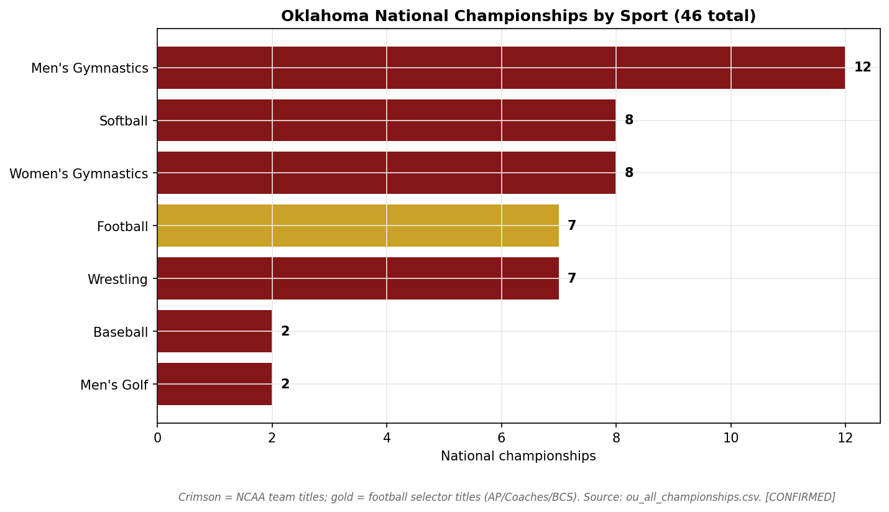
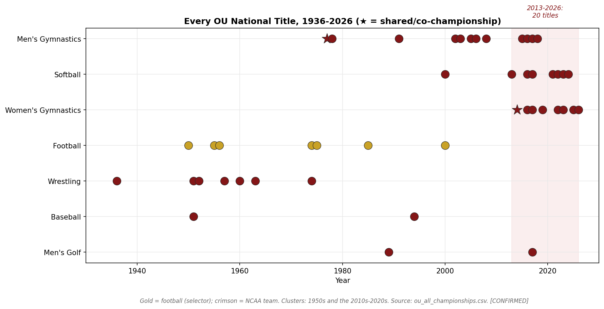
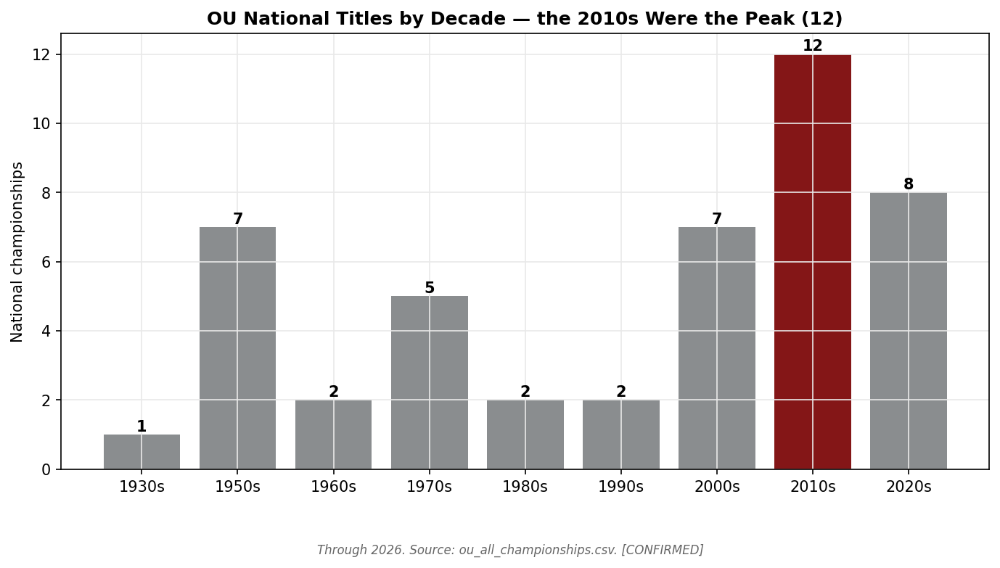
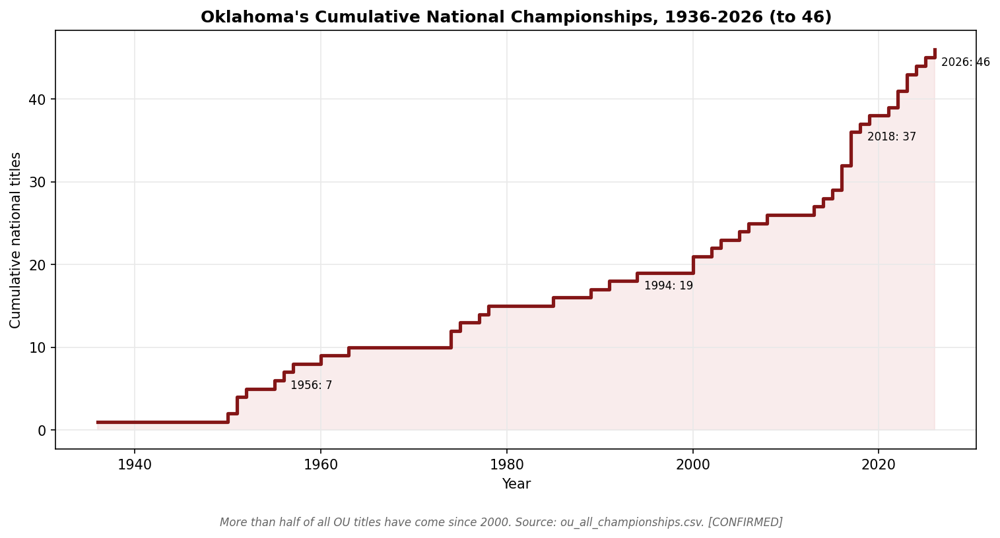

# Oklahoma's 46 National Championships — An Evidence-First Accounting

> Every national title the University of Oklahoma claims, across every sport, with
> the selector/NCAA distinction made explicit, each figure cross-verified against
> multiple independent sources and tagged for confidence. No fabrication; conflicts
> are surfaced, not silently resolved. Built June 2026 from live web research.

**Headline:** Oklahoma officially claims **46 national championships** across **7 sports**.
That number is **39 NCAA-administered team titles + 7 football "selector" titles**
(AP / Coaches' Poll / BCS — football has no NCAA-run championship in OU's title era).
The defining fact of the portfolio is **not** football: **80% of OU's national titles
are in Olympic / non-revenue sports**, and **more than half have come since 2000.**

---

## 1. The master count

| | Count |
|---|---|
| **Total claimed national championships** | **46** |
| NCAA-administered team titles | 39 |
| Football selector titles (AP/Coaches/BCS) | 7 |
| Shared / co-championships (within the 46) | 2 |
| Sports with ≥1 national title | 7 |
| Titles in 2000 or later | 27 (59%) |
| Titles in Olympic/non-revenue sports | 37 (80%) |

The 46 reconciles exactly: **12 + 8 + 8 + 7 + 7 + 2 + 2 = 46** (see §2). This matches
OU Athletics' own advertised total and Wikipedia's summary. `[CONFIRMED — Wikipedia
"Oklahoma Sooners," soonersports.com, cross-checked per sport]`

> **What "national championship" means here.** This report counts **team** national
> championships only. Football's titles are **poll/selector** titles, not NCAA trophies —
> the NCAA never administered a top-division football championship during OU's title years
> (the College Football Playoff began in 2014; OU has won zero CFP titles). We keep
> football in the 46 because OU claims it, but we flag the basis in every table.
> Individual national champions (e.g., OU's ~65 individual wrestling champions) are
> **not** counted as team titles.

---

## 2. By sport

| Sport | Titles | Basis | Window | Coaches |
|---|---|---|---|---|
| **Men's Gymnastics** | **12** | NCAA team | 1977–2018 | Ziert (2) → Buwick (1) → Williams (9) |
| **Softball** | **8** | NCAA team (WCWS) | 2000–2024 | Patty Gasso (8) |
| **Women's Gymnastics** | **8** | NCAA team | 2014–2026 | K.J. Kindler (8) |
| **Football** | **7** | Selector (AP/Coaches/BCS) | 1950–2000 | Wilkinson (3), Switzer (3), Stoops (1) |
| **Wrestling** | **7** | NCAA team | 1936–1974 | Keen (1), Robertson (3), Evans (2), Abel (1) |
| **Baseball** | **2** | NCAA team (CWS) | 1951, 1994 | Baer (1), Cochell (1) |
| **Men's Golf** | **2** | NCAA team | 1989, 2017 | Grost (1), Hybl (1) |

**Men's gymnastics is OU's single most-decorated program (12).** Every sport outside
this list — men's/women's tennis, all track & field, cross country, men's and women's
basketball, soccer, volleyball, women's golf — has **zero** team national titles.
`[CONFIRMED — the official 46 leaves no room for any other sport]`

---

## 3. The timeline: two title clusters, fifty years apart

OU's championships do not arrive at a steady drip. They cluster:

- **The Wilkinson/wrestling 1950s (7 titles):** Bud Wilkinson's football (1950, 1955, 1956),
  Port Robertson's wrestling (1951, 1952, 1957), and the 1951 baseball CWS title. This was
  OU's first golden age — football and the mat, the sports of the era.
- **A long middle (1960s–1990s, 13 titles, scattered):** Switzer-era football (1974, 1975, 1985),
  the start of men's gymnastics (1977, 1978, 1991), the last wrestling title (1974), the first
  men's golf title (1989), and the 1994 baseball CWS title.
- **The modern Olympic-sport dynasty (2000–2026, 27 titles):** This is the real story. Men's
  gymnastics (8 titles 2002–2018), softball (8, 2000–2024), women's gymnastics (8, 2014–2026),
  plus football's last title (2000) and golf's second (2017).

The **2010s alone produced 12 national titles** — as many as OU's entire first 80 years of
men's gymnastics, and the most of any decade in school history. The 2020s already have **8**
through 2026.

**More than half of all OU national championships have been won since 2000** — the program's
identity shifted from a football/wrestling school to a broad-based Olympic-sport powerhouse.
`[CONFIRMED — computed from the master list]`

---

## 4. The coaches behind the titles

Three active-era coaches account for **25 of the 46** (54%):

| Coach | Sport | Titles | Years |
|---|---|---|---|
| **Mark Williams** | Men's Gymnastics | 9 | 2002, 2003, 2005, 2006, 2008, 2015, 2016, 2017, 2018 |
| **K.J. Kindler** | Women's Gymnastics | 8 | 2014, 2016, 2017, 2019, 2022, 2023, 2025, 2026 |
| **Patty Gasso** | Softball | 8 | 2000, 2013, 2016, 2017, 2021, 2022, 2023, 2024 |
| Barry Switzer | Football | 3 | 1974, 1975, 1985 |
| Bud Wilkinson | Football | 3 | 1950, 1955, 1956 |
| Port Robertson | Wrestling | 3 | 1951, 1952, 1957 |

Gasso's softball and Kindler's gymnastics overlap almost exactly (2014–2026), giving OU two
simultaneous Olympic-sport dynasties — the engine of the 2010s–2020s surge. `[CONFIRMED]`

---

## 5. Football: 7 claimed, ~10 unclaimed, only 1 undisputed

Football titles are the most-asked-about and the least clean, because they rest on **polls
and selectors**, not a bracket. The honest breakdown:

- **OU officially claims 7:** 1950, 1955, 1956, 1974, 1975, 1985, 2000.
- **Only 2000 is fully undisputed** — BCS + AP + Coaches' Poll unanimous (13–0, beat Florida State
  in the Orange Bowl). `[CONFIRMED]`
- **1974 is AP-only:** OU was on NCAA probation and ineligible for the UPI Coaches' Poll, which
  gave its title to USC. `[CONFIRMED]`
- **OU does *not* claim ~10 other selector years** (1915, 1949, 1953, 1957, 1967, 1973, 1978,
  1980, 1986, 2003) in which a minor/math selector named the Sooners but the AP/Coaches/BCS title
  went elsewhere. We list these separately in `football_unclaimed_titles.csv` and tag them
  `REPORTED` — the exact list **varies by compilation** (`CONFLICTING`), so no single unclaimed
  year should be treated as settled.

This is the cleanest way to state it: **OU's 7 football titles are real and claimed, but they
are poll titles, and their strength ranges from unanimous (2000) to single-selector.**

---

## 6. Shared and contested titles (flagged, not hidden)

Two of the 46 are **co-championships** — full titles, but genuinely shared:

- **1977 men's gymnastics** — Paul Ziert's team shared the NCAA title. `[CONFIRMED]`
- **2014 women's gymnastics** — OU tied **Florida** at 198.175, the **first tie in NCAA gymnastics
  championship history**; with no tiebreaker, both were named champions. `[CONFIRMED]`

Both are counted in the 46 (OU and the NCAA count them), but a strict "outright titles only" view
would read OU at **44 outright + 2 shared**.

---

## 7. The recent picture: still winning, but not everywhere (2025–2026)

The dynasty is **broad but not uniform** right now. What actually happened in 2025–26:

- **Women's gymnastics: still dominant.** OU won **2025** (def. UCLA) and **2026** (def. LSU) — its
  **7th and 8th** titles, back-to-back. `[CONFIRMED]`
- **Softball: the streak broke.** OU **did not win** 2025 or 2026. In **2025** it reached the WCWS as
  four-time defending champ and lost in the semifinals to Texas Tech (walk-off); in **2026 it missed
  the WCWS entirely**, losing the Norman Super Regional Game 3 to **unseeded Mississippi State, 6–0
  (May 24)** — OU's first missed WCWS since 2015. **Texas won both 2025 and 2026.** `[CONFIRMED —
  resolved against a conflicting source; see audit]`
- **Men's gymnastics: contender, not champion.** OU was the **2026 runner-up** (with 3 individual
  event titles); its last team title remains **2018**. `[CONFIRMED]`
- **Baseball: live.** OU reached the **2026 CWS Finals** vs North Carolina (a best-of-three that was
  **tied 1–1** with Game 3 pending at the time of writing). A win would be OU's **3rd** baseball title
  (first since 1994); it is **not** counted in the 46 until final. Tracked in the baseball module.
  `[NOT_FOUND — in progress]`

So as of mid-2026, OU's championship engine is **women's gymnastics (peaking)** while **softball has
cooled** and **men's gymnastics and baseball are knocking** — see the `near_misses.csv` table.

---

## 8. What the data actually says about Oklahoma

**FACT:** OU is one of the most decorated athletic departments in NCAA history — but its claim to
that rests on **Olympic sports, not the football brand it's famous for.** 80% of its national titles
come from gymnastics, softball, wrestling, and golf; football is 15% and last won in 2000.

**FACT:** OU's championship production is **accelerating and recent** — 27 of 46 titles since 2000, a
record 12 in the 2010s, 8 already in the 2020s — driven by three coaches (Williams, Kindler, Gasso).

**OPINION (analyst):** The popular image of "Oklahoma = football powerhouse" is, by the trophy count,
**out of date.** The modern Sooners are an **Olympic-sport dynasty machine** whose football program,
while historically elite, has the fewest *recent* national titles of its marquee sports. The most
impressive single line on the résumé is not the 7 football polls — it's **men's gymnastics' 12 NCAA
team titles** and the **simultaneous softball + women's gymnastics dynasties** of the last decade.

---

## Integrity notes
- Every title in `ou_all_championships.csv` is `CONFIRMED` by ≥2 independent sources; the football
  *unclaimed* list is `REPORTED`/`CONFLICTING`; the 2026 baseball result is `NOT_FOUND` (live).
- Football titles are labeled selector-based throughout and excluded from the "NCAA team title" count.
- Conflicts (softball 2026 WCWS; football selector lists; co-championships) are documented in
  [`../audit/CHAMPIONSHIPS_AUDIT.md`](../audit/CHAMPIONSHIPS_AUDIT.md).
- Computed aggregates regenerate deterministically via `analyze_championships.py`; counts cross-foot
  to 46 in `validate_championships.py`.
