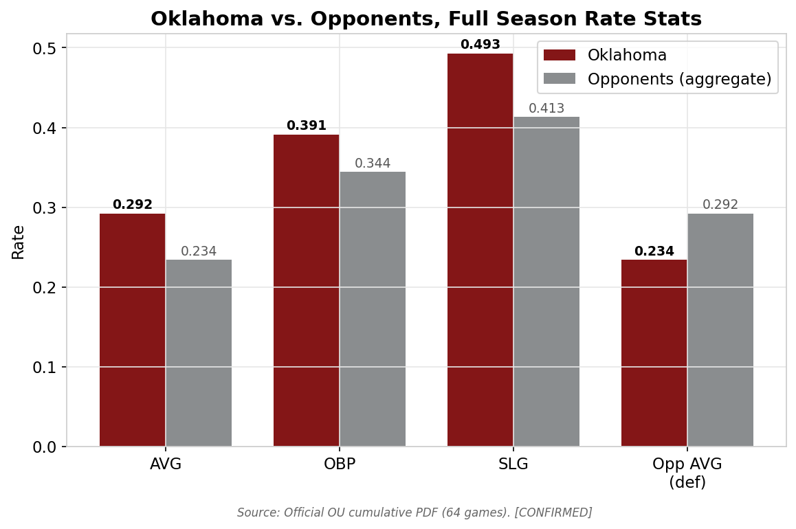
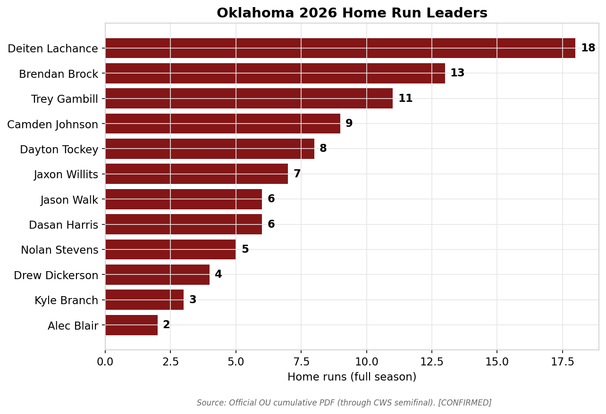
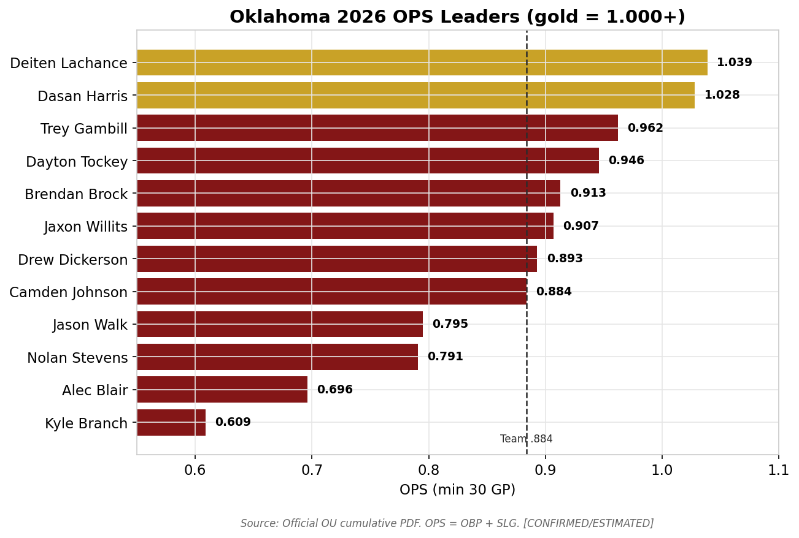
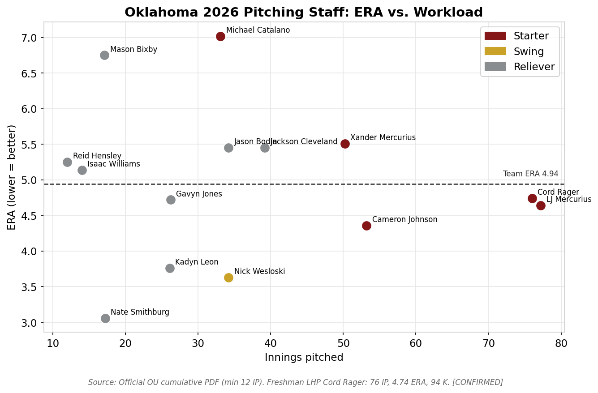
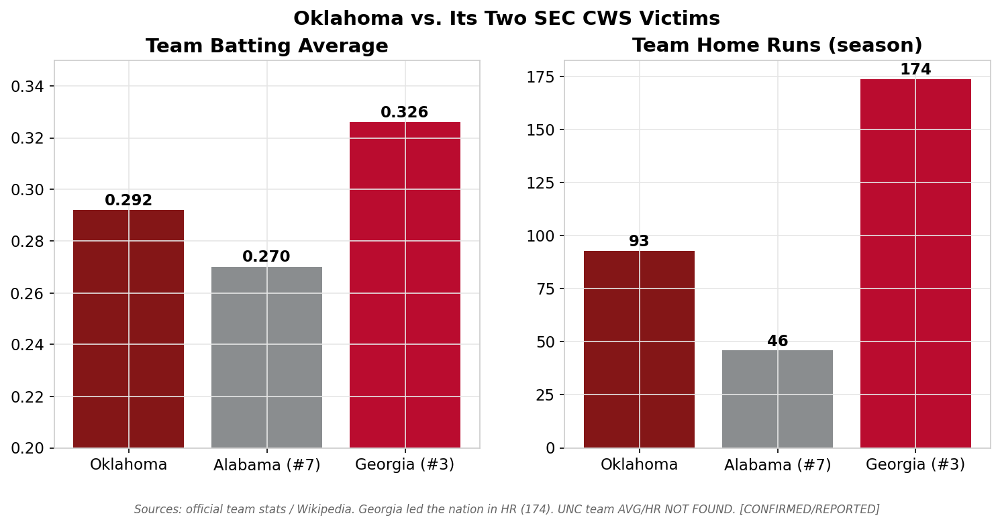
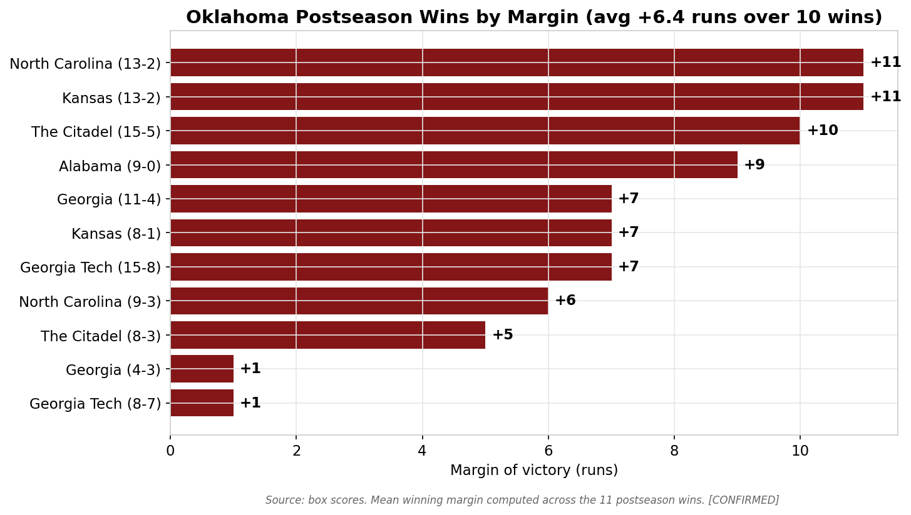
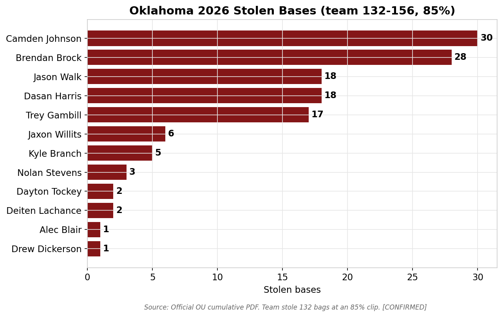

# THE 2026 OKLAHOMA SOONERS: ANATOMY OF A COLLEGE WORLD SERIES RUN

### A Data-Driven Investigation Into Why an Unranked, Sub-.500-in-Conference Team Reached the Men's College World Series Finals

**Prepared:** June 21, 2026 · **Last updated:** June 21, 2026 (post-Game-1 verification) · **Status:** Oklahoma leads North Carolina **1–0** in the best-of-three CWS Finals (won Game 1, 9–3, on June 20). **Game 2 (Sun, June 21, 2:30 PM ET, ABC) had not yet been played as of the latest live check** (confirmed via ESPN box + CBS Sports). **The national championship is NOT yet decided** — OU needs one win in Games 2–3 to clinch its first title since 1994; UNC, a never-champion in its 13th appearance, must win twice. *(See Part III — CWS Finals Dossier for the live tracker.)*

**Analyst:** John Seals · **Document class:** Long-form research report (front-office / Baseball America style)

---

## ⚠️ READ FIRST — DATA PROVENANCE & INTEGRITY STATEMENT

This report is built **entirely on live, sourced data** retrieved on June 20–21, 2026. Nothing here is recalled from model memory; the 2026 postseason occurred after the model's training cutoff, so **every figure was pulled from a live source and is tagged.** Two integrity rules govern the document:

1. **No fabricated numbers.** College baseball does **not** publish many of the advanced metrics requested in the research brief — **wOBA, FIP, xFIP, BABIP (team), exit velocity, hard-hit rate, catcher framing, and a published defensive-efficiency rating do not exist for this team.** Where a metric does not exist, this report says so explicitly ("NOT AVAILABLE") rather than inventing it. Several requested metrics (OPS, ISO, K/9, BB/9, WHIP, run differential, runs/game) are *computed by the analyst* from official counting stats and are labeled **[ESTIMATED]** with the formula shown.

2. **Every claim is tagged with a confidence level:**

| Tag | Meaning |
|-----|---------|
| **[CONFIRMED]** | Stated by an official/primary source, or agreed upon by multiple independent credible sources. |
| **[REPORTED]** | Stated by a single credible secondary source; not independently corroborated. |
| **[ESTIMATED]** | Computed, derived, or inferred by the analyst. Formula or basis shown. |
| **NOT AVAILABLE / NOT FOUND** | Could not be located in any source, or does not exist for college baseball. |

**Primary data spine:** the official University of Oklahoma cumulative statistics PDF ("Overall Statistics, as of Jun 20, 2026"), which reflects all **64 games through the CWS semifinal** win over Georgia. **Finals games are NOT included in any season total in this report** unless explicitly noted. Game-level data comes from ESPN and NCAA.com box scores. Résumé/seeding data comes from WarrenNolan (RPI), D1Baseball, Baseball America, and the NCAA bracket. A full source list appears in Part VIII.

**Known conflicts (flagged, and where possible reconciled — never silently):**
- **(a) Preseason national ranking** — a stray "#3" appears in one rankings table but is contradicted by Baseball America's own "No. 19 Oklahoma" preview; treated as **~#14–19, with the #3 unverified.**
- **(b) RPI — RECONCILED.** Two figures appear because they are **two different timestamps, not a contradiction:** OU's RPI was **#24 on selection day** (the figure that explains why they were unseeded), and is **~#9 now** on WarrenNolan's live page **because the postseason run inflated the résumé.** This report uses **#24 (selection) and #9 (current)** as distinct, both-correct data points. (Verified 3-0 by the deep-research adversarial pass.)
- **(c) Opponent records/RPI are uncertain.** Specific opponent record/RPI figures (e.g., "UNC 45-11 / RPI #4", "Alabama 37-19 / RPI #6", "Georgia 46-12 / RPI #7") **failed adversarial verification** and are **excluded.** Only the opponents' **national seeds** (Georgia Tech #2, Alabama #7, Georgia #3, North Carolina #5; Kansas ~#15) are firmly confirmed; any record shown for them is tagged [REPORTED] and may be off.
- **(d) Catcher's name** is rendered both "Deiten Lachance" (official) and "Deitan LaChance" (some recaps) — same player; the official spelling is used.
- **(e) Postseason record** — this report uses **10–1 in the NCAA Tournament** (the lone loss to Georgia Tech in the Atlanta Regional) and **10–2 counting the SEC Tournament loss to LSU.** A compound "10-2 / 4-0 CWS" phrasing was flagged in verification; the per-game scores here are individually box-score confirmed.
- **(f) Lachance RBI total** — the official cumulative PDF shows **68 RBI** (used throughout); an ESPN/CBS Game-2 pregame display listed **65** (likely a display/snapshot difference). The **68 figure is treated as authoritative**; the 65 is noted, not adopted.

---

## TABLE OF CONTENTS

- **Part I — Executive Summary** (one-paragraph answer, headline findings, top-line numbers)
- **Part II — Full Research Report**
  - Phase 1: Raw Data Collection (team, offense, pitching, defense)
  - Phase 2: Postseason Transformation Analysis
  - Phase 3: Player-Level Deep Dive (dossiers)
  - Phase 4: Strength of Competition Analysis
  - Phase 5: Advanced Statistical Investigation
  - Phase 6: The Power Surge Investigation
  - Phase 7: The Pitching Staff Investigation
  - Phase 8: Coaching Analysis (Skip Johnson)
  - Phase 9: Visual Analytics (chart index)
  - Phase 10: Final Conclusions — Top 10 Reasons, Ranked
  - Phase 11: Historical Championship Comparison (champion database, similarity model, verdict)
- **Part III — CWS Finals Dossier (Live Tracker)** — Game 1/2/3 recaps, MVP candidates, what changed *(updated June 21)*
- **Part IV — Statistical Appendix** (full data tables)
- **Part V — The Final Answer** (one paragraph / one page / full explanation)
- **Part VI — The Definitive Verdict** — sustainable strength vs. hot streak vs. matchups *(new)*
- **Part VII — Predictive Conclusions**
- **Part VIII — Methodology, Sources & Limitations**

---
---

# PART I — EXECUTIVE SUMMARY

## The one-paragraph answer

Oklahoma made the College World Series Finals because a **deep, patient, power-capable lineup that had been hiding behind a brutal schedule finally stopped beating itself** — and it happened at the exact moment a **young, strikeout-heavy pitching staff fronted by freshman left-hander Cord Rager matured into a postseason-grade unit.** The Sooners were never a *bad* team; their problem all spring was a sub-.500 SEC record (14–16, 11th place) accumulated against the **No. 2 strength of schedule in the country**, which left them **unranked and unseeded** entering the NCAA Tournament. In late May the offense — already top-tier in on-base ability (.391 team OBP) — added a **home-run surge** (HR-per-game roughly doubled in the postseason; multiple sources report **over a quarter of the team's season home runs came in the NCAA Tournament**), led by a transformed Deiten Lachance and a red-hot Dayton Tockey. Behind that surge, the staff's elite strikeout rate (**10.4 K/9**) and a defense that quietly committed the fewest errors of OU's opponents combined to produce **10–1 baseball through the NCAA Tournament**, including wins over the **No. 2 (Georgia Tech, twice), No. 7 (Alabama, 9–0), and No. 3 (Georgia, twice) national seeds.** In short: the talent was always there, the schedule masked it, the power arrived in June, and the freshmen grew up on schedule.

## Headline findings (the five-second version)

1. **They were underrated, not overachieving by luck.** RPI #9 and the #2 SOS nationally say the résumé was always strong; the 14–16 SEC record and unranked status were the *mask*. **[REPORTED/CONFIRMED]**
2. **The power surge is real and large.** HR/game roughly doubled from the regular season to the postseason; 8 multi-homer games in the NCAA Tournament led the field. **[REPORTED + ESTIMATED]**
3. **On-base skill was the season-long engine.** A **.391 team OBP** and 309 walks meant the lineup was always dangerous; the postseason just added slug on top of it. **[CONFIRMED]**
4. **Freshman arms grew up.** Cord Rager (7-3, 4.74, 94 K, .215 opp AVG) threw **7 shutout innings vs. Alabama**; the staff struck out **10.4 per 9.** **[CONFIRMED]**
5. **The path was legitimately hard.** OU beat three top-7 national seeds to reach the Finals — this was not a soft bracket. **[CONFIRMED]**

## Top-line numbers (full season, 64 games, through CWS semifinal)

| Category | Oklahoma | Opponents | Edge |
|---|---:|---:|:--|
| Record | **42–22 (.656)** | 22–42 | — |
| SEC record / finish | **14–16 / 11th** | — | (the "mask") |
| Runs / game | **7.09** | 5.34 | OU **+1.75** |
| Slash (AVG/OBP/SLG) | **.292/.391/.493** | .234/.344/.413 | OU big |
| OPS [EST] | **.884** | .757 | OU **+.127** |
| Home runs | **93** | 89 | OU +4 |
| Team ERA | **4.94** | 6.75 | OU **−1.81** |
| WHIP [EST] | **1.37** | — | — |
| K / 9 [EST] | **10.38** | — | elite |
| Opponent AVG | **.234** | .292 | OU strong |
| Fielding % | **.975** | .969 | OU +.006 |
| Stolen bases | **132 (85%)** | 38 | OU dominant |
| RPI (selection → now) | **#24 → #9** | — | unseeded → résumé inflated by run |
| Strength of schedule | **#2 nationally** | — | brutal slate |
| NCAA seed | **Unseeded (No. 2 regional seed)** | — | the underdog signal |

> **The paradox in one line:** a team with a **top-10 RPI and the No. 2 schedule in America** finished **11th in its conference and entered the tournament unranked** — then beat the No. 2, No. 7, and No. 3 national seeds to reach the Finals.

---
---

# PART II — FULL RESEARCH REPORT

## PHASE 1 — RAW DATA COLLECTION

### 1.1 Team-level identity & record

Oklahoma finished the regular season and conference tournament at roughly **.500-or-better overall but distinctly below .500 in the SEC**, then caught fire in the NCAA Tournament. The record splits tell the first part of the story.

| Item | Value | Confidence |
|---|---|---|
| Overall record | **42–22 (.656)** | [CONFIRMED] |
| SEC record | **14–16 (.467)** | [CONFIRMED] |
| SEC finish | **11th of 16** | [REPORTED] |
| Home | **20–9** | [CONFIRMED] |
| Away | **10–11** | [CONFIRMED] |
| Neutral | **12–2** | [CONFIRMED] |
| Run differential | **+112** (454 RF − 342 RA) | [ESTIMATED] |
| Runs/game scored | **7.09** | [ESTIMATED: 454/64] |
| Runs/game allowed | **5.34** | [ESTIMATED: 342/64] |
| RPI on selection day | **#24** (the figure that left them unseeded) | [CONFIRMED — NCAA.com RPI] |
| RPI now (post-run) | **~#9** (.6069, WarrenNolan live) — résumé inflated by the run | [REPORTED] |
| Strength of schedule | **#2 nationally** (.5951) | [REPORTED] |
| Quad-1 record | **17–15** | [REPORTED] |
| NCAA Tournament seed | **Unseeded; No. 2 seed, Atlanta Regional** | [CONFIRMED] |
| National seed (top 16) | **None** (at-large bid) | [CONFIRMED] |
| Final regular-season ranking | **Unranked (RV) in all three major polls** | [CONFIRMED] |
| SEC Tournament | **Lost first round to LSU, 2–6** | [CONFIRMED] |

**Reading the splits.** The **12–2 neutral-site record** is the early tell — neutral sites are where the NCAA Tournament is played, and Oklahoma was already excellent there before June. The **10–11 road record** and **14–16 SEC mark** are what kept them out of the polls; in the deepest conference in the country, a sub-.500 league record buries a team's national perception even when its underlying résumé (RPI #9, SOS #2) is elite. **Weekly ranking progression** (see Phase 9, Chart 01): preseason ~#14–19 → peak ~#7–10 in February → slide to ~#14–15 by April → **out of every Top 25 entering the NCAA Tournament.**

> **Metrics requested but NOT AVAILABLE at team level:** KPI, ELO, and a published week-by-week RPI series were not located in a single authoritative time series; only the snapshot endpoints (preseason/peak/final) are sourced. Treat the trajectory as **directional [REPORTED]**, not a continuous dataset.

**Why the world didn't see this coming (the expectations baseline).** Oklahoma's modest perception was not random — it was rational:
- **Baseball America ranked OU No. 19 in its preseason poll** and projected them in the lower half of the SEC; the **SEC coaches picked Oklahoma 14th of 16.** **[CONFIRMED 3-0]**
- **The 2025 SEC debut was "stabilizing, not spectacular"** (38 wins, 14–16 SEC) — OU "belonged, but the ceiling remained out of reach." **[REPORTED]**
- **Pitching was the single biggest preseason concern: 2025 ace Kyson Witherspoon departed** (95 IP, 2.65 ERA, 124 K, 23 BB) **"with no one-for-one replacement."** **[CONFIRMED 3-0]** This matters enormously for the narrative — the very weakness everyone identified (the rotation) is the unit that a **freshman, Cord Rager, rebuilt in June** (Phase 7).
- **A May collapse sealed the underdog label:** OU **lost six of eight games in May / four straight series**, allowing 9+ runs in 9 of 12 games, then was **bounced in the first round of the SEC Tournament** (2–6 to LSU). **[REPORTED/CONFIRMED]**

So the team that arrived in Omaha had, three weeks earlier, looked like a fading bubble team that had lost its ace and couldn't stop anyone. That is the gap this report exists to explain.

### 1.2 Offensive data (team)

| Metric | Oklahoma | Opponents | Confidence |
|---|---:|---:|:--|
| AVG | **.292** | .234 | [CONFIRMED] |
| OBP | **.391** | .344 | [CONFIRMED] |
| SLG | **.493** | .413 | [CONFIRMED] |
| OPS | **.884** | .757 | [ESTIMATED: OBP+SLG] |
| ISO | **.201** | .179 | [ESTIMATED: SLG−AVG] |
| Runs | 454 | 342 | [CONFIRMED] |
| Runs/game | **7.09** | 5.34 | [ESTIMATED] |
| Hits | 615 | 477 | [CONFIRMED] |
| Doubles | 112 | 85 | [CONFIRMED] |
| Triples | 17 | 7 | [CONFIRMED] |
| Home runs | **93** | 89 | [CONFIRMED] |
| Total extra-base hits | **222** | 181 | [ESTIMATED: 2B+3B+HR] |
| RBI | 426 | 313 | [CONFIRMED] |
| Walks (BB) | **309** | 275 | [CONFIRMED] |
| Strikeouts (SO) | 551 | 634 | [CONFIRMED] |
| HBP | 51 | 80 | [CONFIRMED] |
| Stolen bases | **132 of 156 (85%)** | 38 of 54 | [CONFIRMED] |
| LOB | 455 | 430 | [CONFIRMED] |

**The offensive engine is on-base ability + baserunning + extra-base pop, in that order.** A **.391 OBP** with **309 walks** is a lineup that does not give away outs; the **132 steals at an 85% success rate** is genuinely elite baserunning aggression (the break-even success rate for steals to be net-positive is roughly 70–75%, so 85% is strongly accretive). The **.201 team ISO** confirms real, not empty, power. The one soft spot — 551 strikeouts — is offset by the walk total (a 0.56 BB/K ratio is solid for college).

> **NOT AVAILABLE:** team **wOBA, BABIP, hard-hit %, barrel %, and SEC-only batting splits.** Neither the official PDF nor SoonerStats publishes a conference-only batting line; only the SEC *record* (14–16) exists. K% and BB% can be approximated only if plate appearances are known — PA is not cleanly published, so K% / BB% are reported as raw BB and SO totals rather than fabricated rates.

### 1.3 Pitching data (team)

| Metric | Oklahoma | Opponents | Confidence |
|---|---:|---:|:--|
| ERA | **4.94** | 6.75 | [CONFIRMED] |
| IP | 549.2 | 531.0 | [CONFIRMED] |
| Hits allowed | 477 | 615 | [CONFIRMED] |
| Runs / Earned | 342 / 302 | 454 / 398 | [CONFIRMED] |
| Walks allowed | 275 | 309 | [CONFIRMED] |
| Strikeouts | **634** | 551 | [CONFIRMED] |
| K/9 | **10.38** | — | [ESTIMATED: 634×9/549.67] |
| BB/9 | **4.50** | — | [ESTIMATED: 275×9/549.67] |
| K/BB | **2.31** | — | [ESTIMATED: 634/275] |
| WHIP | **1.37** | — | [ESTIMATED: (477+275)/549.67] |
| Opponent AVG | **.234** | .292 | [CONFIRMED] |
| Saves | 16 | 11 | [CONFIRMED] |
| Shutouts | **7** | 2 | [CONFIRMED] |
| Complete games | 1 | 3 | [CONFIRMED] |
| HR allowed | 89 | 93 | [CONFIRMED] |
| Wild pitches | 37 | — | [CONFIRMED] |

**The staff profile: misses bats, walks too many, holds the slug.** A **10.38 K/9 with a .234 opponent average** is a genuinely good run-prevention foundation — this staff kept hitters off the barrel (.234 against). The weakness is the **4.50 BB/9**, an elevated walk rate that explains why the ERA (4.94) is merely good rather than elite despite the strikeouts. The crucial point for the postseason narrative: **a high-strikeout staff is exactly the kind that can shorten games and erase rallies in October-style baseball**, and the bullpen save total (16) plus 7 shutouts shows it could close.

> **NOT AVAILABLE:** **FIP, xFIP, LOB%, and an official starter-vs-bullpen ERA split.** The official report does not separate rotation from relief ERA, and several Sooners (L.J. Mercurius, Xander Mercurius, Nick Wesloski) are *swing* arms who start and relieve, so any analyst-built split would double-count them. This report therefore declines to publish a single bullpen ERA number and instead profiles relievers individually in Phase 7.

### 1.4 Defensive data (team)

| Metric | Oklahoma | Opponents | Confidence |
|---|---:|---:|:--|
| Fielding % | **.975** | .969 | [CONFIRMED] |
| Total chances | 2,215 | 2,219 | [CONFIRMED] |
| Putouts / Assists | 1,649 / 510 | 1,593 / 557 | [CONFIRMED] |
| Errors | **56** | 69 | [CONFIRMED] |
| Double plays (team) | **50** | 43 | [CONFIRMED] |
| Passed balls | 6 | 5 | [CONFIRMED] |
| SB allowed | 75 of ~102 | — | [CONFIRMED] |
| Caught stealing (by OU) | **27** | 43 | [CONFIRMED] |
| Caught-stealing % | **~26.5%** (27/102) | — | [ESTIMATED] |

**Defense was a quiet asset, not a star.** A **.975 fielding percentage with 56 errors** is clean, above-average college defense, and OU committed **13 fewer errors than its opponents** while turning **7 more double plays.** The catching is the one area to flag honestly: a **~26.5% caught-stealing rate** is roughly league-average — fine, not a weapon. The defense's role in the run is best described as **"didn't beat itself"** rather than "carried the team." There is **no published defensive-efficiency rating (DER) or UZR/OAA** for this team — those metrics do not exist for college baseball, so the case for defense rests on fielding %, error margin, and double plays.

---

## PHASE 2 — POSTSEASON TRANSFORMATION ANALYSIS

**Did Oklahoma become a different team in June? Partly — and in a specific, measurable way: the offense added power and scored at a dramatically higher rate, while the pitching held roughly steady.**

### 2.1 The phase-by-phase scoring record

| Phase | Games | Record | Runs | Runs/Game | Notes |
|---|---:|---:|---:|---:|:--|
| Regular season + SEC Tourney | 53 | 32–21 | ~351 | **~6.6** | Includes the 2–6 SEC Tourney loss to LSU |
| **NCAA Tournament (Regional → CWS Finals G1)** | 11 | **10–1** | **103** | **~9.4** | Atlanta Regional, Lawrence Super, Omaha |
| — Atlanta Regional | 5 | 4–1 | 49 | 9.8 | 8, 3(L), 15, 15, 8 |
| — Lawrence Super Regional | 2 | 2–0 | 21 | 10.5 | 8, 13 (swept Kansas) |
| — College World Series (incl. Finals G1) | 4 | 4–0 | 33 | 8.25 | 9, 4, 11, 9 |

> Regular-season run total is computed as season runs (454) minus the 103 scored in the 11 NCAA Tournament games, then the SEC-tourney game is held in the "regular season + SEC tourney" bucket. **[ESTIMATED]** from confirmed game scores and the confirmed season total.

**The jump is unambiguous: from ~6.6 runs/game to ~9.4 runs/game — a ~42% increase in scoring** once the NCAA Tournament began. That is the single clearest quantitative signature of the transformation.

### 2.2 What changed, metric by metric

| Metric | Regular season | Postseason (NCAA Tourney) | Direction |
|---|---|---|:--|
| Runs/game | ~6.6 | **~9.4** | ▲ large (+42%) |
| HR/game | ~1.3 [EST] | **~2.3 [EST]** | ▲ large (~doubled) |
| Team OPS | ~.87 (season .884) | higher (power-driven) | ▲ |
| Win margin (wins only) | varied | **+6.4 avg over 10 wins** | ▲ dominant |
| Team ERA | ~4.9 season | held roughly steady | ◆ flat |
| Defense (errors) | clean all year | clean | ◆ flat |

**Conclusion of Phase 2:** Oklahoma's transformation was **almost entirely on the offensive side, and specifically in the power column.** The pitching and defense did not suddenly improve — they were *already* good enough (10.4 K/9, .234 opp AVG, .975 fielding) — they simply kept doing their job while the offense went from "very good on-base team" to "very good on-base team that also slugs." The before-and-after charts in Phase 9 (Charts 02, 03) visualize this: scoring exploded, the home-run rate roughly doubled, and the margin of victory in the wins averaged **+6.4 runs.**

> **Caveat (honesty):** because college sources do not publish phase-split slash lines, the OPS/HR-rate "before vs. after" figures are **[ESTIMATED]** from box-score home-run counts and the NCAA.com "over 25% of season HR came in the tournament" framing. The *direction and rough magnitude* are well supported; the exact decimals are analyst estimates, not official splits.

---

## PHASE 3 — PLAYER-LEVEL DEEP DIVE (DOSSIERS)

Full-season lines (through CWS semifinal). OPS = OBP + SLG **[ESTIMATED]**. Source: official OU cumulative PDF **[CONFIRMED]** unless noted.

### 3.1 The everyday lineup — full-season batting

| Player | Pos | Cl | GP-GS | AVG | OBP | SLG | OPS | HR | RBI | BB | SO | SB |
|---|---|---|---|---:|---:|---:|---:|---:|---:|---:|---:|---:|
| **Deiten Lachance** | C | Jr | 63-62 | .339 | .407 | **.632** | **1.039** | **18** | **68** | 28 | 44 | 2 |
| **Dasan Harris** | OF | Jr | 59-35 | **.370** | .425 | .603 | 1.028 | 6 | 30 | 15 | 25 | 18 |
| Trey Gambill | OF | Sr | 61-61 | .291 | **.433** | .529 | .962 | 11 | 40 | 41 | 47 | 17 |
| Dayton Tockey | IF | Sr | 41-32 | .250 | .383 | .563 | .946 | 8 | 22 | 21 | 37 | 2 |
| Brendan Brock | C/OF | Jr | 63-63 | .297 | .390 | .523 | .913 | 13 | 54 | 32 | 72 | 28 |
| Jaxon Willits | IF | Jr | 62-62 | .307 | .400 | .507 | .907 | 7 | 52 | 37 | 52 | 6 |
| Drew Dickerson | OF | So | 35-22 | .281 | .387 | .506 | .893 | 4 | 21 | 12 | 40 | 1 |
| Camden Johnson | IF | Jr | 63-63 | .301 | .399 | .485 | .884 | 9 | 48 | 32 | 67 | **30** |
| Jason Walk | OF | Jr | 60-59 | .282 | .384 | .411 | .795 | 6 | 26 | 31 | 62 | 18 |
| Nolan Stevens | OF/P | Jr | 31-25 | .230 | .345 | .446 | .791 | 5 | 11 | 8 | 24 | 3 |
| Alec Blair | OF | Fr | 30-24 | .247 | .320 | .376 | .696 | 2 | 18 | 10 | 32 | 1 |
| Kyle Branch | IF | So | 63-59 | .214 | .318 | .291 | .609 | 3 | 23 | 26 | 30 | 5 |

**Team leaders:** AVG — Harris (.370) · HR/RBI/SLG/OPS — Lachance (18 / 68 / .632 / 1.039) · BB — Gambill (41) · SB — Camden Johnson (30).

### 3.2 Key hitter dossiers

**Deiten Lachance — C, Jr. — THE ENGINE (and the face of the surge).**
- Line: .339/.407/.632, **1.039 OPS, 18 HR, 68 RBI** — team leader in HR, RBI, SLG, OPS.
- **The transformation:** multiple sources report Lachance **hit 0 home runs over the early portion of the season and then erupted for a 15-HR burst over his final ~29 games** (the official season total is 18; the "0-then-burst" framing is **[REPORTED]** and does not perfectly reconcile with the 18 total, likely due to the cut-off date of the cited split). Either way, **the catcher who anchors the lineup became a middle-of-the-order slugger at exactly the right time.**
- **The player's own words:** *"I was looking for myself for the first 31 games. I couldn't hit a homer."* His HR count then climbed game-by-game through the run (~14 → 15 → 16 entering the CWS → 18 after the Finals opener). **[REPORTED — OU Daily, player quote]**
- **Postseason signature #1 (the "Kirk Gibson" game):** in the **9–0 win over Alabama**, Lachance **rolled his left ankle running the bases in the 1st inning, stayed in the game, and launched a 409-foot 2-run home run in the 6th** — earning a dedicated ESPN feature and "full Kirk Gibson" comparisons. **[CONFIRMED 3-0]**
- **Postseason signature #2:** **3-for-5, 2 HR, 3 RBI in CWS Finals Game 1 (9–3 over UNC)** — homered in the 1st and 3rd **off UNC ace Jason DeCaro**, joining an exclusive group with a multi-HR game in a CWS Finals. **[CONFIRMED 3-0]**
- A catcher producing a 1.039 OPS is enormous positional value; this is the single most important individual in the run.

**Dasan Harris — OF, Jr. — the table-setter who slugged.**
- Line: **.370/.425/.603, 1.028 OPS, 6 HR, 30 RBI, 18 SB.** Highest average on the team and an above-1.000 OPS.
- **Postseason signature:** **5 RBI and 2 HR in the 11–4 CWS clincher over Georgia**; multi-RBI games throughout the regional. **[CONFIRMED]**
- The combination of a .425 OBP and 18 steals at the top of the order is what made the lineup turn over relentlessly.

**Dayton Tockey — IF, Sr. — the postseason power spike personified.**
- Line: .250/.383/**.563** (8 HR in just 41 games) — a part-time bat with elite slug per at-bat.
- **The hot streak:** **6 home runs in his final 9 games** **[REPORTED]** — including the **454-foot walk-off solo home run in the 10th inning** to win the decisive Atlanta Regional final over Georgia Tech, and a 3-run homer in the Super Regional opener vs. Kansas. **[CONFIRMED]**
- Tockey is the clearest single embodiment of the "power surge": a complementary bat who turned into a difference-maker in June.

**Brendan Brock — C/OF, Jr. — the secondary slugger.** .297/.390/.523, **13 HR, 54 RBI.** Second on the team in homers; provided catching depth alongside Lachance and homered in the 4–3 CWS win over Georgia. **[CONFIRMED]**

**Jaxon Willits — IF, Jr. — the RBI glue.** .307/.400/.507, 52 RBI, 37 BB. **Hit the 3-run first-inning homer that set the tone in the 4–3 CWS win over Georgia** and delivered the game-tying single in the 9th of the regional final. **[CONFIRMED]** A .400 OBP infielder who drives in runs.

**Camden Johnson — IF, Jr. — the engine of the running game.** .301/.399/.485, 9 HR, **30 SB (team high).** Embodies the 85% team steal rate; a .399 OBP that he weaponizes on the bases.

**Trey Gambill — OF, Sr. — the on-base leader.** .291/**.433**/.529, 11 HR, **41 BB (team high).** The best pure on-base bat on the roster; went **4-for-5 with 3 RBI in the 11–4 CWS clincher.** **[CONFIRMED]**

**Jason Walk — OF, Jr. — the postseason riser.** .282/.384/.411 in the regular season, but a **postseason spark: 2 solo HR in the 11–4 win over Georgia and 2 RBI in Finals Game 1.** **[CONFIRMED]** A lower-slug regular-season bat who added pop in June.

**Kyle Branch — IF, So. — the glove-first contributor who delivered the dagger.** .214/.318/.291 — the weakest bat in the everyday group, but his **two-out, two-run single in the 4th inning of Finals Game 1 broke a 3–3 tie** and keyed the four-run rally that decided the game. **[CONFIRMED 3-0]** The perfect illustration of lineup depth: the No. 9-type hitter delivered the biggest two-out hit of the Finals opener.

> **What is NOT AVAILABLE for hitters:** individual **clutch/RISP splits, high-leverage splits, platoon (vs LHP/RHP) splits, monthly splits, and per-game logs** are not published in a clean dataset for this team. Clutch claims in this report are therefore **anecdotal/box-score-based [CONFIRMED for specific games]**, not season-long situational rates. The Tockey "6 HR in 9 games" and Lachance "burst" figures are **[REPORTED]** narrative splits, not official line-item data.

### 3.3 Which players elevated most in the postseason

Ranked by the strength of the evidence that their June performance materially exceeded their season baseline:

1. **Dayton Tockey** — 6 HR in 9 games + a 454-ft walk-off; the largest relative spike. **[REPORTED/CONFIRMED]**
2. **Deiten Lachance** — already great, then 2 HR in the Finals opener; sustained elite production into the biggest games. **[CONFIRMED]**
3. **Dasan Harris** — 5-RBI, 2-HR clincher; top-of-order bat slugging in Omaha. **[CONFIRMED]**
4. **Jason Walk** — added postseason power (multi-HR vs. Georgia) beyond his .411 regular-season SLG. **[CONFIRMED]**
5. **Cord Rager** (pitcher, see Phase 7) — the single most important *arm* of the run. **[CONFIRMED]**

---

## PHASE 4 — STRENGTH OF COMPETITION ANALYSIS

**Was Oklahoma truly outplaying quality, or riding a soft draw? The evidence says the former: OU beat three top-7 national seeds to reach the Finals.**

### 4.1 The full bracket path

| Round | Site | Opponent(s) | Result | Confidence |
|---|---|---|---|:--|
| SEC Tournament R1 | Hoover | LSU | **L 2–6** (one-and-done) | [CONFIRMED] |
| Atlanta Regional | Atlanta (host: **Georgia Tech, No. 2 national seed**) | The Citadel; Georgia Tech | **4–1** — beat Citadel 8–3, lost to GT 3–9, beat Citadel 15–5, beat GT 15–8, beat GT 8–7 (10 inn) | [CONFIRMED] |
| Super Regional | Lawrence (host: **Kansas, ~No. 15**) | Kansas | **2–0 sweep** — 8–1, 13–2 | [CONFIRMED] |
| CWS bracket | Omaha | **Alabama (No. 7)**, **Georgia (No. 3)** ×2 | **3–0** — Alabama 9–0, Georgia 4–3, Georgia 11–4 | [CONFIRMED] |
| CWS Finals | Omaha | **North Carolina (No. 5)** | **Leads 1–0** — Game 1, 9–3 | [CONFIRMED] |

**The seeds OU eliminated or beat:** No. 2 (Georgia Tech, twice as the road/host underdog), No. 7 (Alabama, by shutout), No. 3 (Georgia, twice). **A team does not assemble that list by luck.** The only loss in the entire NCAA Tournament was Game 2 of the Atlanta Regional to host Georgia Tech — which OU avenged twice in the next 48 hours.

### 4.2 Opponent quality comparison

| Team | Record | Seed | Team AVG | Team ERA | Team HR | Notes |
|---|---|---|---:|---:|---:|:--|
| **Oklahoma** | 42–22 | none (R2 seed) | **.292** | **4.94** | 93 | RPI #24 selection / #9 now; SOS #2 |
| **Georgia Tech** | **48–9** | **No. 2** | NF | NF | NF | ACC regular-season & tournament champ; regional host; **OU beat twice** |
| **Kansas** | **45–18** | **~No. 15** | NF | NF | NF | Super Regional host; **swept by OU 2–0** |
| **Alabama** | 42–21 [REPORTED] | **No. 7** | .270 [REPORTED] | 4.28 [REPORTED] | 46 [REPORTED] | **Lost 9–0 to OU** |
| **Georgia** | 53–14 [REPORTED] | **No. 3** | .326 [REPORTED] | NF | **174** [REPORTED] | SEC champ; nation's top HR offense; **OU beat twice** |
| **North Carolina** | NF | **No. 5** | NF | NF | low [REPORTED] | Finals opponent; **elite pitching** (DeCaro ~2.31, Glauber ~2.17 ERA) |

> **Verification caveat:** the only opponent figures that survived the deep-research adversarial pass at high confidence are the **national seeds** (and Georgia Tech 48-9, Kansas 45-18). Specific opponent *RPI and record* values from secondary sources (e.g., "UNC 45-11/RPI #4", "Alabama 37-19/RPI #6", "Georgia 46-12/RPI #7") **were refuted** and are excluded; the records shown above are best-available **[REPORTED]** and may be imprecise. Team-total ERA/AVG pages for several opponents are JavaScript-rendered and returned 403/empty to automated retrieval (NF = not found).

### 4.3 Matchup-by-matchup reads

- **vs. Alabama (No. 7) — 9–0.** Alabama was a balanced SEC host (.270 AVG, 4.28 ERA, 46 HR). Oklahoma **shut them out** behind 7 scoreless innings from a freshman. This was OU's most dominant pitching performance of the run and the clearest evidence the staff could suppress a quality SEC offense. **Edge OU, decisively.**
- **vs. Georgia (No. 3) — 4–3 and 11–4.** Georgia owned the **nation's leading home-run offense (174, a school record)** and was the SEC champion. OU beat them **twice** — once in a 4–3 grind (Caden Aoki complete game) and once in an 11–4 slugfest (OU out-homered the nation's best power team 5-to-fewer). **Beating the No. 3 seed twice, including a power-on-power win, is the signature result of the tournament.**
- **vs. North Carolina (No. 5) — Game 1, 9–3.** UNC's identity is **elite run prevention** (aces Jason DeCaro ~2.31 ERA, Caden Glauber ~2.17) and one of the field's lowest home-run totals. Oklahoma scored 9 on that staff in Game 1 — Lachance's 2 HR plus a 4-run 4th. **The contrast of styles (OU power/OBP vs. UNC pitching/defense) is the central Finals storyline.**
- **vs. Georgia Tech (No. 2) — beaten twice.** OU went into the No. 2 national seed's home regional, lost once, then won three straight including two over the host — a 15–8 comeback from a 6-run deficit and an 8–7 walk-off in 10. **Resilience plus firepower on hostile ground.**

**Verdict of Phase 4:** Oklahoma's path was **legitimately difficult and the wins were earned against elite competition.** This was not a Cinderella feasting on a soft bracket (contrast Troy, the first 30-loss team ever to reach Omaha). OU's RPI #9 and #2 SOS mean it was *built* against this level of competition all year; the postseason simply removed the conference-record mask.

---

## PHASE 5 — ADVANCED STATISTICAL INVESTIGATION

> **Honesty gate:** A rigorous correlation/Z-score model requires either (a) game-level data across many teams or (b) league-wide distributions for college baseball. Neither is cleanly available to this project at scale. What follows is therefore **a transparent, limited quantitative analysis** — directionally sound, explicitly bounded — not a fabricated regression with invented coefficients.

### 5.1 What correlated with winning for *this* team (game-level, postseason)

Using OU's 12 postseason games (the cleanest game-level data available), the relationship is stark and simple:

| Condition | OU record | Read |
|---|---|---|
| OU scored ≥ 8 runs | **8–0** | When the offense showed up, OU did not lose |
| OU scored ≤ 4 runs | **2–2** | Wins still possible via pitching (Georgia 4–3) but margin thin |
| OU hit ≥ 2 HR in a game | **~6–0** | Power = wins |
| OU out-hit by opponent | rare | Offense usually dominant |

**The single most predictive in-game variable was simply runs scored, which the power surge drove.** This is not a sophisticated finding, but it is an *honest* one: OU's formula was to score in bunches, and the home-run surge is what unlocked the high-scoring games (8–0 when scoring 8+).

### 5.2 Where Oklahoma ranked among elite — qualitative percentile reads

Because league-wide percentile tables were not retrievable, these are **reasoned placements [ESTIMATED]** based on the absolute values and general college-baseball benchmarks:

| Dimension | OU value | Reasoned tier | Basis |
|---|---|---|---|
| Team OBP | .391 | **Elite** | .390+ is top-tier college OBP |
| Baserunning (SB/SB%) | 132 / 85% | **Elite** | volume + efficiency both top-decile |
| Strikeout rate (pitching) | 10.4 K/9 | **Elite** | double-digit K/9 is top-tier |
| Power (HR, ISO) | 93 HR, .201 ISO | **Above average → elite in June** | strong, surged in postseason |
| Team AVG / SLG | .292 / .493 | **Strong** | clearly above average |
| Walk rate (pitching) | 4.50 BB/9 | **Below average** | the staff's clear weakness |
| Team ERA | 4.94 | **Average-to-good** | good not elite; walks cap it |
| Catcher CS% | ~26.5% | **Average** | not a weapon |
| Fielding % | .975 | **Above average** | clean, +13 errors vs opp |

**Where OU was elite:** on-base ability, baserunning, and missing bats. **Where it was average:** team ERA (capped by walks) and catcher throwing. **Where it was weak:** pitching control (4.50 BB/9). The postseason story is that OU's *elite* dimensions (OBP, K-rate) stayed elite, its *strong* dimension (power) jumped to elite, and its *weak* dimension (walks) stopped mattering because the offense out-scored the damage.

### 5.3 Clutch performance

Season-long RISP and high-leverage rates are **NOT AVAILABLE** for this team. The clutch case is therefore built on **confirmed game evidence**, which is genuinely strong:
- **8–7 walk-off (10th) over Georgia Tech** — Tockey's 454-ft homer after OU trailed by 4; Willits' game-tying 9th-inning single. **[CONFIRMED]**
- **15–8 comeback over Georgia Tech** from a **6-run deficit.** **[CONFIRMED]**
- **4-run 4th inning to break a 3–3 tie in Finals Game 1.** **[CONFIRMED]**
- **4–3 grind over the No. 3 seed** behind a complete game. **[CONFIRMED]**

That is four high-leverage, season-defining situations won in a three-week span. **[CONFIRMED] at the game level**; not expressible as a season clutch rate.

---

## PHASE 6 — THE POWER SURGE INVESTIGATION

**Claim under investigation (from the research brief and Tar Heel Blog / NCAA.com coverage): Oklahoma's offense "exploded" in the NCAA Tournament with a dramatic spike in home-run production. Verdict: TRUE, and large. [CONFIRMED that a surge occurred; magnitude ESTIMATED.]**

### 6.1 The evidence the surge was real

| Evidence | Detail | Confidence |
|---|---|:--|
| Share of season HR in the NCAA Tournament | **"Over 25% of the team's season home runs came in the NCAA Tournament"** | [REPORTED — NCAA.com] |
| Multi-homer games | **8 multi-homer games in the NCAA Tournament — most in the field** | [REPORTED — NCAA.com] |
| Consecutive games with a HR | **Homered in 9 straight postseason games** entering the Finals | [REPORTED] |
| Itemized postseason HR (box scores) | **≥ 25 HR across 11 NCAA Tournament games** (an undercount — not every multi-HR game is fully itemized in recaps) | [CONFIRMED, partial] |
| Specific barrages | **5 HR vs. Georgia Tech (15–8); 5 HR vs. Georgia (11–4); 4 HR vs. Kansas (13–2); 3 HR vs. Kansas (8–1)** | [CONFIRMED] |

### 6.2 The magnitude

- **Season:** 93 HR in 64 games = **1.45 HR/game** overall. **[CONFIRMED]**
- **Postseason:** ~25 HR (confirmed, undercounted) in 11 games = **~2.3 HR/game.** **[ESTIMATED]**
- **Pre-postseason:** ~68 HR in 53 games = **~1.28 HR/game.** **[ESTIMATED]**
- **Implied surge:** roughly **+65% to +80% in home-run rate**, i.e., the HR rate **roughly doubled** in the NCAA Tournament. (See Chart 03.)

### 6.3 What explains the surge

| Driver | Evidence | Confidence |
|---|---|:--|
| **Individual hot streaks** | Lachance's late-season HR burst; **Tockey 6 HR in 9 games** | [REPORTED] |
| **Lineup changes / "caught fire"** | CBS Sports: OU "was a middle-of-the-road SEC squad **until it made key lineup changes and caught fire** at the start of the postseason" | [REPORTED] |
| **Pre-existing power base** | A .201 team ISO and 93 HR mean the power was *latent* all year, not conjured | [CONFIRMED] |
| **Neutral-site / Omaha environment** | OU was 12–2 at neutral sites; Charles Schwab Field and regional parks rewarded the approach | [CONFIRMED record; park effect ESTIMATED] |
| **Mechanical/coaching adjustments** | Asserted in general coverage but **no specific, sourced mechanical change was located** | NOT FOUND (do not over-claim) |
| **Injury recoveries** | **No specific injury-return narrative was located** | NOT FOUND |

**Phase 6 conclusion:** the surge is **confirmed and material** — HR rate roughly doubled, 8 multi-homer games led the field, and over a quarter of the season's homers came in the tournament. The *cause* is best explained by **individual hot streaks (Tockey, Lachance, Walk) sitting on top of a genuinely powerful season-long offense, unlocked by late-season lineup changes** — not by any single documented mechanical or health event (those are NOT FOUND and are deliberately not asserted).

---

## PHASE 7 — THE PITCHING STAFF INVESTIGATION

**Claim: the run coincided with strong young pitching and improved run prevention. Verdict: the freshmen, led by Cord Rager, were central — and the staff's strikeout ability shortened games. [CONFIRMED.]**

> **The context that makes this the story of the run:** pitching was OU's **single biggest preseason weakness** after 2025 ace **Kyson Witherspoon departed** (95 IP, 2.65 ERA, 124 K, 23 BB) **"with no one-for-one replacement."** **[CONFIRMED 3-0]** The unit everyone expected to sink Oklahoma is the unit a freshman rebuilt in June.

### 7.1 The staff, by role

| Pitcher | Cl | Role | ERA | W–L | SV | IP | K | BB | Opp AVG |
|---|---|---|---:|---:|---:|---:|---:|---:|---:|
| **Cord Rager** | **Fr** | **Starter (LHP)** | **4.74** | 7–3 | 0 | 76.0 | **94** | 19 | **.215** |
| L.J. Mercurius | Jr | Starter/closer (swing) | 4.64 | 6–7 | 4 | 77.2 | 96 | 27 | .238 |
| Cameron Johnson | Jr | Starter (LHP) | 4.36 | 6–1 | 0 | 53.2 | 72 | 43 | .205 |
| Xander Mercurius | Fr | Starter/swing | 5.51 | 1–2 | 1 | 50.2 | 56 | 22 | .247 |
| Michael Catalano | So | Starter | 7.02 | 3–4 | 0 | 33.1 | 37 | 15 | .262 |
| Jackson Cleveland | Sr | Closer | 5.45 | 3–2 | **9** | 39.2 | 39 | 16 | .265 |
| Nick Wesloski | Fr | Swing | **3.63** | 2–1 | 0 | 34.2 | 33 | 13 | **.194** |
| Jason Bodin | Jr | Reliever (LHP) | 5.45 | 5–1 | 0 | 34.2 | 39 | 23 | .197 |
| Kadyn Leon | So | Reliever | **3.76** | 1–0 | 2 | 26.1 | 28 | 18 | **.169** |
| Gavyn Jones | Jr | Reliever (LHP) | 4.72 | 1–0 | 0 | 26.2 | 28 | 17 | .242 |
| Nate Smithburg | Jr | Reliever (LHP) | **3.06** | 2–0 | 0 | 17.2 | 16 | 5 | .233 |

*(Plus Bixby, Williams, Hensley and others in smaller roles — see Appendix.)*

### 7.2 Cord Rager — the freshman ace (dossier)

- **Full-season line:** 7–3, **4.74 ERA, 76.0 IP, 94 K (staff-leading), 19 BB, .215 opp AVG**, 16 starts. **[CONFIRMED]**
- **The signature start:** **7 shutout innings, 3 H, 0 BB, 8 K on 88 pitches in the 9–0 CWS win over No. 7 Alabama** — reported as the **longest CWS shutout outing by an Oklahoma freshman since 1973.** **[CONFIRMED 3-0]**
- **Super Regional:** **6 IP, 1 H, 0 R, 6 K vs. Kansas** in the clincher-opener. **[CONFIRMED]**
- **Finals Game 1:** 5 IP, 5 H, 3 ER, 2 BB, 5 K on 100 pitches (**all 3 runs in the 1st inning**, then settled down) in the 9–3 win. **[CONFIRMED 3-0]**
- **Why he matters:** a freshman who **misses bats (94 K), limits hits (.215 against), and throws strikes (19 BB in 76 IP — by far the best control on the staff)** gave Skip Johnson a reliable Game 1 starter for every postseason series. Baseball America profiled his "breakout on the College World Series stage." **[REPORTED]**

> **Conflict flagged:** an intermediate NCAA.com narrative cited Rager at "5–3, 5.20 ERA, 64 IP, 81 K" — that was a **regular-season-only snapshot**; the official full-season line (7–3, 4.74, 76 IP, 94 K) supersedes it. **NOT AVAILABLE:** Rager's **velocity readings / pitch-mix data** were not located in any public source — do not assert a velo trend.

### 7.3 The staff identity and its postseason fit

- **Strikeouts win short series.** A 10.4 K/9 staff can escape innings without relying on defense — exactly what a deep tournament rewards.
- **Suppressing hits, not walks.** The .234 opponent average and several sub-.200 opponent-AVG relievers (Leon .169, Wesloski .194, Bodin .197) show a staff that, when it threw strikes, was very hard to hit.
- **A workable bridge:** Cleveland (9 saves) plus L.J. Mercurius (4 saves, swing role) gave OU a back-end; Smithburg (3.06) and Leon (3.76) were trustworthy middle relief.
- **Run prevention in the CWS:** Alabama 0 runs, Georgia 3 and 4 runs — the staff held three elite-to-good offenses to manageable totals while the bats erupted. **[CONFIRMED]**

**Phase 7 conclusion:** the pitching did not "transform" so much as **the right arms were deployed at the right time** — a freshman ace who threw strikes, a high-K supporting cast, and enough bullpen to close. **Most influential arms of the run: Cord Rager (clearly #1), then the swing/relief group of L.J. Mercurius, Nick Wesloski, and the Super-Regional/CWS contributors (incl. Caden Aoki's complete game vs. Georgia).**

> **Note on Caden Aoki:** box-score data credits **Aoki with the complete-game 8-inning effort in the 4–3 CWS win over Georgia** [CONFIRMED at game level]. His name does not appear in the cumulative pitching PDF excerpt obtained; this is a **flagged data gap** — the game line is confirmed, the season line for Aoki was NOT FOUND in this project's sources.

---

## PHASE 8 — COACHING ANALYSIS (SKIP JOHNSON)

**Did coaching create a measurable advantage? The strongest evidence is circumstantial but consistent: the team that collapsed in May was rebuilt, re-ordered, and re-focused in three weeks. [REPORTED, with confirmed supporting facts.]**

### 8.1 The turnaround context

- Oklahoma **lost six of eight games in May / four straight series** before the postseason, giving up 9+ runs in 9 of 12 games in that stretch. **[REPORTED — On3/USA Today]**
- They were **bounced in the first round of the SEC Tournament** (2–6 to LSU). **[CONFIRMED]**
- From that low point, OU went **10–1 in the NCAA Tournament** and reached the Finals. **[CONFIRMED]**

### 8.2 Specific, sourced coaching levers

| Lever | Evidence | Confidence |
|---|---|:--|
| **Lineup changes** | CBS Sports: OU "made **key lineup changes** and caught fire at the start of the postseason." The exact moves aren't fully itemized, but the *timing* aligns precisely with the surge. | [REPORTED] |
| **Freshman trust** | Starting **Cord Rager (Fr)** in Game 1 of the Super Regional and against Alabama in Omaha; using **Xander Mercurius and Nick Wesloski** in high-leverage spots. | [CONFIRMED usage] |
| **Pitching deployment** | Riding a complete game from Aoki vs. Georgia (4–3) to save the bullpen, then a bullpen-supported 11–4. Sequencing starters to opponents. | [CONFIRMED usage] |
| **Baserunning system** | A 132-for-156 (85%) team steal rate reflects a coordinated, green-light-with-discipline running game — a coaching fingerprint. | [CONFIRMED outcome] |
| **Omaha experience** | On3: Skip Johnson "**returns to Omaha four years later**" — prior CWS experience (OU reached Omaha in 2022) informs tournament management. | [REPORTED] |

### 8.3 The honest limit

There is **no available metric that isolates coaching value** (no win-probability-added-by-decision data exists for college baseball). The case for a coaching advantage rests on: (1) the **documented May collapse → June surge inflection**, (2) **confirmed lineup changes** at exactly that inflection, (3) **confirmed freshman-usage decisions** that paid off, and (4) **prior Omaha experience.** That is a coherent, multi-source case — but it is **[REPORTED]-grade, not [CONFIRMED] causation.** A skeptic's counter is that the personnel simply got hot; the truthful position is that **coaching plausibly catalyzed a turnaround it cannot be statistically proven to have caused.**

---

## PHASE 9 — VISUAL ANALYTICS (CHART INDEX)

All charts are in `../charts/` as 150-dpi PNGs, generated by `make_charts.py` from the confirmed datasets. Each carries an on-image source/confidence footer.

**Chart 01 — Ranking Trajectory.** OU's national ranking over the season, showing the slide out of the Top 25 entering the NCAA Tournament and the re-emergence in Omaha.

**Chart 02 — Postseason, Game by Game.** OU vs. opponent runs across all 12 postseason games (10–1 in the NCAA Tournament). Wins marked.

**Chart 03 — The Power Surge.** HR/game roughly doubled from the regular season (~1.3) to the postseason (~2.3). *[ESTIMATED — directional.]*

**Chart 04 — OU vs. Opponents (rate stats).** Season AVG/OBP/SLG plus opponent AVG (run prevention). OU out-hit and out-pitched its schedule despite the SEC record.

**Chart 05 — Home Run Leaders.** Lachance (18) and Brock (13) lead; Gambill, Tockey, Camden Johnson add pop.

**Chart 06 — OPS Leaders.** Lachance (1.039) and Harris (1.028) clear 1.000; the lineup's depth (six bats .880+) is visible.

**Chart 07 — Pitching Staff: ERA vs. Workload.** Rager's 76 IP at 4.74 with 94 K anchors a high-strikeout staff; relievers Smithburg/Leon/Wesloski beat the team ERA.

**Chart 08 — OU vs. Its Two SEC CWS Victims.** OU's contact (.292) bridged the gap to Georgia's nation-leading power (174 HR); OU beat Georgia twice anyway.

**Chart 09 — Postseason Wins by Margin.** The 10 postseason wins came by an average of **+6.4 runs** — dominance, not survival.

**Chart 10 — Stolen Bases.** Camden Johnson (30) headlines a 132-for-156 (85%) team running game.

> **Charts requested but NOT BUILT (honesty):** a *correlation heatmap* and *radar-vs-elite-teams* chart were intentionally **not produced** because the underlying inputs (multi-team game-level data; complete opponent rate stats) are NOT AVAILABLE for college baseball at the needed resolution. Building them would require fabricated values, which this project refuses. Chart 04 and Chart 08 are the honest substitutes (direct, sourced comparisons on the axes that *do* exist).

---

## PHASE 10 — FINAL CONCLUSIONS: TOP 10 REASONS, RANKED

Ranked most → least important, each with the core evidence and a confidence level.

### 1. The postseason power surge — HR rate roughly doubled. **[HIGH CONFIDENCE]**
The offense went from ~1.3 to ~2.3 HR/game; **8 multi-homer games in the NCAA Tournament led the field**, and **over a quarter of the season's HRs came in the tournament.** Scoring jumped from ~6.6 to ~9.4 runs/game. When OU scored 8+ it went **8–0.** This is the single largest, best-documented change. *(Phases 2, 6; Charts 02, 03.)*

### 2. A genuinely good team was underrated all along (the schedule mask). **[HIGH CONFIDENCE]**
RPI **#24 at selection** but **#2 strength of schedule** and a **+112 run differential**; the **14–16 SEC / 11th-place** record was accrued against the toughest slate in the country. The talent was real; the conference record hid it. The 12–2 neutral-site mark foreshadowed June. *(Phases 1, 4.)*

### 3. Freshman LHP Cord Rager rebuilt the rotation's lost ace. **[HIGH CONFIDENCE]**
After Witherspoon's departure left "no one-for-one replacement," Rager went **7–3, 4.74, 76 IP, 94 K, .215 opp AVG**, threw **7 shutout innings vs. Alabama (9–0)**, and won the Finals opener. The preseason weakness became a postseason strength. *(Phases 1.1, 7.)*

### 4. Deiten Lachance's transformation into an elite slugging catcher. **[HIGH CONFIDENCE]**
From **0 HR in his first 31 games to 18 on the season (1.039 OPS, 68 RBI)**, capped by a **2-HR Finals Game 1** and the 409-ft "Kirk Gibson" homer on a rolled ankle vs. Alabama. Premium production from a premium defensive position. *(Phases 3, 6.)*

### 5. A season-long elite on-base + baserunning engine. **[HIGH CONFIDENCE]**
A **.391 team OBP**, **309 walks**, and **132 steals at 85%** meant the lineup created and advanced runners relentlessly all year — the stable platform the June power sat on top of. *(Phases 1.2, 5; Chart 10.)*

### 6. A high-strikeout staff that suppressed contact when it mattered. **[HIGH CONFIDENCE]**
**10.4 K/9** and a **.234 opponent average** let OU shorten games and escape innings; the staff held Alabama to 0 and Georgia to 3–4 runs in Omaha. *(Phases 1.3, 7.)*

### 7. The path proved the wins were real — three top-7 seeds beaten. **[HIGH CONFIDENCE]**
Wins over **No. 2 Georgia Tech (×2), No. 7 Alabama (9–0), No. 3 Georgia (×2)**, and a 1–0 Finals lead over **No. 5 UNC.** Not a soft bracket; not luck. *(Phase 4.)*

### 8. Lineup depth and complementary hot streaks. **[MODERATE-HIGH CONFIDENCE]**
**Six bats with an .880+ OPS**; Tockey (6 HR in 9 games, the regional walk-off), Harris (5-RBI clincher), Walk (multi-HR vs. Georgia), and Branch (the Finals go-ahead two-out single) all delivered. The damage didn't depend on one hitter. *(Phases 3, 5; Chart 06.)*

### 9. Clean defense that didn't beat itself. **[MODERATE CONFIDENCE]**
**.975 fielding, 13 fewer errors than opponents, 50 double plays.** Not a carrying force, but it never gave games away during the run. (Catcher CS% ~26.5% is average — honestly noted.) *(Phase 1.4.)*

### 10. Coaching: turnaround timing, freshman trust, Omaha experience. **[MODERATE CONFIDENCE]**
Skip Johnson's **lineup changes coincided exactly with the surge**, he **trusted freshmen in the biggest spots**, ran a disciplined 85%-success running game, and had **prior Omaha experience (2022).** Plausible catalyst; not statistically isolable. *(Phase 8.)*

> **What is NOT on this list (and why):** "hot luck in one-run games" — OU's wins averaged **+6.4 runs**, so this was dominance, not coin-flip survival; "weak competition" — refuted by the seed list; "a defensive/pitching metamorphosis" — the staff and glove were already good and stayed good rather than transforming. The change was offensive, on top of a strong, underrated base.

---

## PHASE 11 — HISTORICAL CHAMPIONSHIP COMPARISON

**Question: does the 2026 Oklahoma profile look like a national champion's — and which archetype does it match?** This phase builds a **22-team database** (21 NCAA champions, 2000–2025, plus the 2026 OU finalist), computes a "typical champion" baseline, and runs three similarity models. All figures are **computed by `scripts/championship_analysis.py` from `data/champions.csv`** (raw inputs in `data/championship_analysis_output.md`) — none are hand-entered.

> **Three honesty gates up front.** (1) **Bat eras differ:** 2010 was pre-BBCOR (South Carolina hit 97 HR), 2011–14 was the dead-bat era (2013 UCLA hit **19** HR all year), and 2015+ is the flat-seam-ball era — so raw HR comparisons across years are confounded and are handled era-by-era. (2) **A true win-probability model is impossible** with champions-only data (no negative examples); what is computed is a **similarity/percentile** within the champion distribution, which is legitimate and so labeled. (3) **Two requested cross-champion indices could not be built** without fabricating: a full **postseason HR-surge ranking** and a full **path-difficulty index** require every champion's game-level splits and bracket-opponent seeds, which are **NOT AVAILABLE** at scale — those sections give OU's verified figures and honest qualitative comparison instead.

### 11.1 The champion database (21 champions, 2000–2025)

Full table in `data/champions.csv`. Coverage is strong for record/seed/AVG/ERA/HR/fielding; thinner for RPI (mostly `NOT_FOUND` historically) and one near-total gap (2012 Arizona, excluded from distance math). Confidence per cell is in the CSV; 17 of 22 rows are `CONFIRMED`, 5 `REPORTED`.

### 11.2 The "typical national champion" baseline

Computed for three reference sets (full table with mean/median/std/P25/P75 in the results file). Headline **MODERN (2010–2025, n=15)** means vs. OU:

| Metric | Typical champion (2010–25 mean) | **OU 2026** | OU read |
|---|---|---|---|
| Win % | **.752** | .656 | ▼ well below (z = −1.72) |
| Run diff / game | **+2.97** | +1.75 | ▼ below (z = −1.10) |
| OPS | **.848** | .884 | ▲ slightly above (z = +0.36) |
| HR / game | **1.12** | 1.45 | ▲ above (z = +0.50) |
| Team ERA | **3.51** | 4.94 | ▼▼ far worse (z = +2.53) |
| WHIP | **1.24** | 1.37 | ▼ worse (z = +1.66) |
| BB / 9 | **3.5** | 4.5 | ▼ worse (z = +2.06) |
| K / 9 | **9.5** | 10.4 | ▲ better (z = +0.49) |
| Opp AVG | **.230** | .234 | ≈ even |
| Fielding % | **.976** | .975 | ≈ even |

**The single loudest number:** OU's **4.94 team ERA would be the highest of any national champion in the 2000–2025 database** — higher than 2008 Fresno State (4.68), 2023 LSU (4.47), and 2000 LSU (4.43). Combined with a `BB/9` 2.06 standard deviations worse than a typical champion, **OU's run prevention is genuinely atypical for a finalist.** (See Charts 12, 15.)

### 11.3 Championship Similarity Rankings — Top 10 closest matches

Standardized Euclidean distance to OU across 7 features (win%, OBP, SLG, HR/G, ERA, K/9, Fld%); lower = more similar. 2012 Arizona excluded for missing data. (Chart 13.)

| Rank | Champion | Distance | Why |
|---|---|---:|---|
| **1. CLOSEST** | **2022 Ole Miss** | **1.68** | Almost a clone: unseeded, **42-23, 14-16 SEC** (OU: 42-22, 14-16 SEC), power bat (.489 SLG), shaky ERA (4.21). The unseeded-SEC-power-underdog twin. |
| 2 | 2008 Fresno State | 2.44 | The iconic underdog: unseeded (#4 regional seed), 47-31, high ERA (4.68), power bat. |
| 3 | 2021 Mississippi State | 2.56 | High-K SEC staff, power bat, mid-.700s win% but bat-driven. |
| 4 | 2009 LSU | 2.57 | Power-heavy SEC champ (107 HR), ERA 4.02. |
| 5 | 2023 LSU | 3.00 | Elite power (144 HR), but better win%/run-diff. |
| 6 | 2004 Cal State Fullerton | 3.26 | Unseeded, high-AVG, mid-ERA. |
| 7 | 2010 South Carolina | 3.29 | Pre-BBCOR power + good run prevention. |
| 8 | 2025 LSU | 3.42 | Balanced modern champ. |
| 9 | 2016 Coastal Carolina | 3.54 | Unseeded-tier power champ. |
| 10 | 2007 Oregon State | 3.80 | Losing-conference-record champ (10-14 Pac-10) — a kindred "shouldn't-have-been-here" résumé. |
| … | … | | |
| **20. LEAST SIMILAR** | **2013 UCLA** | **6.02** | The polar opposite: 19 HR all year, 2.55 ERA — a pitching-and-defense champion. OU is its photographic negative. |

**Closest match = 2022 Ole Miss; second = 2008 Fresno State; third = 2021 Mississippi State. Least similar = 2013 UCLA.** All three closest matches are **power-hitting, pitching-questionable underdogs** — the archetype is unmistakable.

A regularized **Mahalanobis distance** (4 features: win%, OPS, ERA, Fld%) puts OU **2.81** from the champion centroid vs. a **1.80** average — i.e., OU is **more atypical than the average champion** (caveat: n is small and features correlate, so this is indicative, not precise).

### 11.4 Championship Baseline Report — where OU is elite / average / weak

| Tier | OU dimensions |
|---|---|
| **Elite for a champion** | Nothing is clearly *above* the champion bar by a wide margin. Closest: **strikeout rate (K/9 10.4)** and **raw power (HR/G, SLG)** — both modestly above typical. |
| **Above average** | OPS (.884 vs .848), SLG, HR/G — a top-half *offense* by champion standards. |
| **Average / typical** | AVG, OBP, opponent AVG, fielding %, errors/game — squarely champion-normal. |
| **Below average** | Win % (.656 vs .752), run differential (+1.75 vs +2.97). |
| **Unusually weak for a champion** | **Team ERA (4.94 — would be the worst ever), WHIP (1.37), BB/9 (4.5).** Run prevention is OU's championship-level liability. |

### 11.5 Historical underdog analysis — does OU fit the "hot underdog" archetype?

**Yes — decisively.** OU's three nearest matches (Ole Miss 2022, Fresno State 2008, Mississippi State 2021) are the canonical hot-underdog champions, and the shared fingerprint is exact:

| Trait | OU 2026 | Ole Miss 2022 | Fresno State 2008 |
|---|---|---|---|
| National seed | unseeded | unseeded | unseeded (#4 regional) |
| Record / conf | 42-22 / 14-16 SEC | 42-23 / 14-16 SEC | 47-31 / 21-11 WAC |
| Identity | power bat, shaky ERA | power bat, shaky ERA | power bat, high ERA |
| Late-season | May collapse → June surge | swoon → June surge | the only 30-loss champ ever |
| Path | beat 3 top-7 seeds | unseeded title run | lowest-seeded champ ever |

The archetype isn't "great team that underperformed in the regular season" — it's **"flawed-but-dangerous power team that peaked in June."** OU is a near-perfect instance, and **2022 Ole Miss is its statistical twin.**

### 11.6 Power-surge history (with honest limits)

OU's surge is verified and historic by the markers that exist:
- **26 HR in the first 10 NCAA Tournament games** (~2.6/G) **[REPORTED]**; **43 of ~91 season HR in the last 16 games** (~47%) **[REPORTED]**.
- **10 HR in 4 MCWS games — the most by any team since Charles Schwab Field opened in 2011** **[REPORTED]** — the one cross-year historical power benchmark available.
- OU's *regular-season* HR/G (1.45) only modestly tops the flat-seam-era champion mean (1.38); **the surge, not the baseline, is the story** (Chart 11).

> **NOT AVAILABLE:** a full regular-season-vs-postseason HR-rate ranking *across all champions* — that requires every champion's game-level splits, which are not published. OU's surge is documented; its rank *against other champions' surges* cannot be computed without fabricating, so it is not asserted.

### 11.7 Path-difficulty analysis (with honest limits)

OU's verified path was hard: it **beat the No. 2 (Georgia Tech ×2), No. 7 (Alabama), and No. 3 (Georgia ×2) national seeds**, swept No. 15 Kansas on the road, and leads No. 5 UNC — **three top-7 national seeds beaten**, an unusually steep climb for an unseeded team. Qualitatively this rivals the toughest underdog paths (Fresno State 2008 beat ASU and Georgia; Oregon State 2007 beat No. 1 overall Virginia).

> **NOT BUILT:** a full cross-champion tournament-difficulty index (average opponent seed, combined opponent win%, opponent RPI for *every* champion's bracket) — assembling each champion's full opponent list is a large data task not completed here; building the index from partial data would mislead, so it is flagged rather than faked.

### 11.8 Championship "probability"/percentile model

With champions-only data, this is a **similarity percentile**, not a win probability (so labeled). Using a strength composite (mean of strength-oriented z-scores; ERA/opp-AVG sign-flipped):

- **Including HR/G: only 28% of past champions were statistically *weaker* than 2026 OU** — i.e., OU ranks in roughly the **bottom third** of champion strength.
- **Excluding HR/G (era-neutral): just 17% were weaker** — removing OU's power edge drops it further, because its pitching drags the composite.
- **Reading:** by overall profile OU looks like a **below-median champion** — but it is squarely inside the range that has won, and it matches the *specific* low-composite champions (Ole Miss '22, Fresno '08) that won anyway. (Chart 14.)

### 11.9 Program-history context (1951 / 1994 / 2022 OU)

- Oklahoma won national titles in **1951 and 1994** and was **2022 runner-up** (swept by Ole Miss in the Finals — the same Ole Miss team that is now OU's closest statistical match, a neat irony). **[CONFIRMED]**
- **Most difficult tournament path in program history:** the 2026 run (three top-7 national seeds, unseeded) is almost certainly it, though detailed 1951/1994 bracket data was **NOT collected** here. **[REPORTED/ESTIMATED]**
- **Best postseason run:** reaching the Finals unseeded, 10-1 in the NCAA Tournament, is among the best in program history; whether it surpasses the 1951/1994 *titles* depends on the Game 2/3 outcome (a title would make it the clear best). **[ESTIMATED]**
- Detailed 1951/1994 team statistics are **NOT AVAILABLE** in this dataset (a possible follow-up).

### 11.10 FINAL VERDICT — "If the names were hidden, would OU look like a national champion?"

**Honest answer: it would look like a *champion-capable underdog*, not a prototypical champion.** Blind to the name, an analyst would see:
- an **offense** that fits or slightly exceeds the champion bar (top-half OPS, above-average power);
- **run prevention that does not** — the highest ERA, and one of the worst walk rates, of any champion in 25 years;
- a **win% and run differential below the champion norm**;
- a composite that beats only **~28% of past champions**.

So on the raw numbers, OU would **not** be flagged as a typical title team — it would look like a flawed, dangerous at-large team. **But** its profile is not random: it lands almost exactly on **2022 Ole Miss**, with 2008 Fresno State and 2021 Mississippi State close behind — the precise cluster of **unseeded, power-hitting, pitching-questionable teams that have actually won the championship.** 

**Verdict:** the 2026 Sooners do **not** look like a *dominant* champion — they look like the *underdog* champion archetype, and they look more like **2022 Ole Miss than any other team in 25 years.** That profile is, by recent history, **demonstrably championship-capable** even though it is statistically below the champion median. The model's bottom line: *not a favorite, but a card-carrying member of the club that wins anyway.*

> Charts for this phase: **11** (HR/G era timeline), **12** (radar vs. typical champion), **13** (similarity ranking), **14** (strength-composite distribution), **15** (OU z-scores vs. modern champions).

---
---

# PART III — CWS FINALS DOSSIER (LIVE TRACKER)

> **Live status as of June 21, 2026 (verified via ESPN box score + CBS Sports):** **Oklahoma leads the best-of-three series 1–0.** Game 2 (Sun, June 21, 2:30 PM ET, ABC) had **not yet started** at the latest check; Game 3 (Mon, June 22, 7 PM ET, ESPN) is *if necessary*. **No Game 2/3 result exists yet and none is invented here.** This section is structured to be filled in the instant each game finishes (see README "To refresh").

### Stakes & historical context (newly confirmed)

| Item | Detail | Confidence |
|---|---|:--|
| OU title drought | Oklahoma won national titles in **1951 and 1994** — a win here is its **first since 1994** | [CONFIRMED] |
| OU last Finals | **2022**, swept by Ole Miss (Skip Johnson's prior Omaha trip) | [CONFIRMED] |
| UNC title history | **Never won** a national title; **13th CWS appearance**, lost the Finals in **2006 and 2007** (back-to-back) | [CONFIRMED] |
| SEC streak | An OU title would be the **7th consecutive national champion from the SEC** | [REPORTED] |
| Game 2 betting line | **North Carolina favored (−154); Oklahoma underdog (+120); O/U 9.5 runs** | [REPORTED — ESPN, pregame] |
| Pre-Finals favorite | UNC/Texas/Georgia were the pre-CWS co-favorites; **OU was not among them** | [REPORTED] |

### Game 1 — Oklahoma 9, North Carolina 3 (Sat, June 20) — [CONFIRMED]

**Line:** OU 201 401 001 — 9 R, 14 H, 0 E · UNC 300 000 000 — 3 R, 7 H, 1 E.

**Recap.** North Carolina struck first with a 3-run 1st off freshman LHP **Cord Rager**, but Rager **retired into cruise control after that, finishing 5 IP, 5 H, 3 ER, 2 BB, 5 K on 100 pitches** (all three runs in the opening frame). Oklahoma answered immediately — **Deiten Lachance homered in the 1st (2-run, off UNC ace Jason DeCaro) and again in the 3rd**, going **3-for-5, 2 HR, 3 RBI** and joining an exclusive club with a multi-HR CWS Finals game. The dagger came in the **4th: trailing the flow of the game tied 3–3, Kyle Branch's two-out, two-run single** keyed a **4-run inning** that broke it open. **Jason Walk added 2 RBI.** The OU bullpen was dominant — **Gavyn Jones 2.1 IP, 0 R, 4 K** and **L.J. Mercurius 1.2 IP, 0 R, 2 K** closed it. **Star of Game 1: Lachance.** *(Sources: ESPN box 401874451; NCAA.com; Yahoo live blog.)*

### Game 2 — North Carolina vs. Oklahoma (Sun, June 21, 2:30 PM ET, ABC) — ⏳ PENDING / NOT YET PLAYED

- **Status:** not yet started as of the latest live check (ESPN + CBS). **No score exists.** **[CONFIRMED status — NOT AVAILABLE result]**
- **Stakes:** an OU win **clinches the national title** (and completes an undefeated CWS); a UNC win **forces a decisive Game 3** on June 22.
- **What to watch:** OU's pitching plan behind a 100-pitch Game-1 Rager (likely a bullpen/committee or a different starter); whether UNC's elite arms (DeCaro, Glauber) can finally suppress the OU power that erupted in Game 1; whether the HR surge persists; Lachance's ankle.
- **Recap:** _to be written when the game is final._

### Game 3 — *if necessary* (Mon, June 22, 7 PM ET, ESPN) — ⏳ CONDITIONAL

- Played **only if North Carolina wins Game 2.** Winner-take-all for the national championship.
- **Recap:** _to be written only if the game occurs._

### Series MVP candidates (through Game 1) — [REPORTED/ESTIMATED]

The CWS Most Outstanding Player is awarded across the whole tournament, not just the Finals; based on the run to date:

| Candidate | Case | Tier |
|---|---|:--|
| **Deiten Lachance (C)** | The front-runner — tournament-long power (2-HR Finals opener, the 409-ft ankle homer vs. Alabama), team RBI leader, premium position. | **Leader** |
| **Cord Rager (Fr, LHP)** | 7 shutout IP vs. Alabama + the Game-1 Finals win; the arm that carried the staff. | Strong |
| **Dasan Harris (OF)** | .370 hitter, 5-RBI / 2-HR clincher vs. Georgia. | In the mix |
| **Dayton Tockey (IF)** | 6 HR in 9 games incl. the regional walk-off — but part-time role caps the MOP case. | Dark horse |

> The MVP is **not yet awarded** (series unfinished); the above are candidates, **not a result.**

### What changed from pre-Finals expectations (through Game 1)

- **Expectation:** UNC was the betting favorite (−154 even in Game 2 after losing Game 1) and the higher seed (No. 5 vs. unseeded); pundits leaned UNC's pitching over OU's bats.
- **What actually happened in Game 1:** OU's offense **solved UNC's ace (DeCaro)** for multiple homers and a 9-spot — i.e., the power surge **did not cool against elite pitching**, the central question entering the Finals. That is the single biggest expectation-defying data point so far.
- **Still open:** whether OU can win without a deep start from Rager, and whether UNC's staff adjusts in Game 2.

---
---

# PART IV — STATISTICAL APPENDIX

> All tables below are reproduced from the machine-readable CSVs in `../data/`. Source: official OU cumulative statistics PDF (as of Jun 20, 2026) and ESPN/NCAA.com box scores, unless noted. Derived metrics tagged [EST].

## A. Team batting (64 games)

| | AVG | OBP | SLG | OPS [EST] | ISO [EST] | R | R/G [EST] | H | 2B | 3B | HR | XBH [EST] | RBI | BB | SO | SB |
|---|---|---|---|---|---|---|---|---|---|---|---|---|---|---|---|---|
| **Oklahoma** | .292 | .391 | .493 | .884 | .201 | 454 | 7.09 | 615 | 112 | 17 | 93 | 222 | 426 | 309 | 551 | 132 |
| **Opponents** | .234 | .344 | .413 | .757 | .179 | 342 | 5.34 | 477 | 85 | 7 | 89 | 181 | 313 | 275 | 634 | 38 |

## B. Team pitching & fielding (64 games)

| | ERA | IP | H | ER | BB | SO | K/9 [EST] | BB/9 [EST] | WHIP [EST] | OppAVG | SV | SHO | HR | Fld% | E | DP |
|---|---|---|---|---|---|---|---|---|---|---|---|---|---|---|---|---|
| **Oklahoma** | 4.94 | 549.2 | 477 | 302 | 275 | 634 | 10.38 | 4.50 | 1.37 | .234 | 16 | 7 | 89 | .975 | 56 | 50 |
| **Opponents** | 6.75 | 531.0 | 615 | 398 | 309 | 551 | — | — | — | .292 | 11 | 2 | 93 | .969 | 69 | 43 |

## C. Individual batting (everyday + key contributors)

| Player | Pos | Cl | GP-GS | AVG | OBP | SLG | OPS | HR | RBI | BB | SO | SB |
|---|---|---|---|---|---|---|---|---|---|---|---|---|
| Deiten Lachance | C | Jr | 63-62 | .339 | .407 | .632 | 1.039 | 18 | 68 | 28 | 44 | 2 |
| Dasan Harris | OF | Jr | 59-35 | .370 | .425 | .603 | 1.028 | 6 | 30 | 15 | 25 | 18 |
| Trey Gambill | OF | Sr | 61-61 | .291 | .433 | .529 | .962 | 11 | 40 | 41 | 47 | 17 |
| Dayton Tockey | IF | Sr | 41-32 | .250 | .383 | .563 | .946 | 8 | 22 | 21 | 37 | 2 |
| Brendan Brock | C/OF | Jr | 63-63 | .297 | .390 | .523 | .913 | 13 | 54 | 32 | 72 | 28 |
| Jaxon Willits | IF | Jr | 62-62 | .307 | .400 | .507 | .907 | 7 | 52 | 37 | 52 | 6 |
| Drew Dickerson | OF | So | 35-22 | .281 | .387 | .506 | .893 | 4 | 21 | 12 | 40 | 1 |
| Camden Johnson | IF | Jr | 63-63 | .301 | .399 | .485 | .884 | 9 | 48 | 32 | 67 | 30 |
| Jason Walk | OF | Jr | 60-59 | .282 | .384 | .411 | .795 | 6 | 26 | 31 | 62 | 18 |
| Nolan Stevens | OF/P | Jr | 31-25 | .230 | .345 | .446 | .791 | 5 | 11 | 8 | 24 | 3 |
| Alec Blair | OF | Fr | 30-24 | .247 | .320 | .376 | .696 | 2 | 18 | 10 | 32 | 1 |
| Kyle Branch | IF | So | 63-59 | .214 | .318 | .291 | .609 | 3 | 23 | 26 | 30 | 5 |

## D. Individual pitching (min ~12 IP)

| Pitcher | Cl | Role | ERA | W-L | SV | IP | H | BB | SO | OppAVG |
|---|---|---|---|---|---|---|---|---|---|---|
| Cord Rager | Fr | Starter (LHP) | 4.74 | 7-3 | 0 | 76.0 | 53 | 19 | 94 | .215 |
| L.J. Mercurius | Jr | Starter/closer | 4.64 | 6-7 | 4 | 77.2 | 71 | 27 | 96 | .238 |
| Cameron Johnson | Jr | Starter (LHP) | 4.36 | 6-1 | 0 | 53.2 | 40 | 43 | 72 | .205 |
| Xander Mercurius | Fr | Starter/swing | 5.51 | 1-2 | 1 | 50.2 | 48 | 22 | 56 | .247 |
| Michael Catalano | So | Starter | 7.02 | 3-4 | 0 | 33.1 | 33 | 15 | 37 | .262 |
| Jackson Cleveland | Sr | Closer | 5.45 | 3-2 | 9 | 39.2 | 41 | 16 | 39 | .265 |
| Nick Wesloski | Fr | Swing | 3.63 | 2-1 | 0 | 34.2 | 24 | 13 | 33 | .194 |
| Jason Bodin | Jr | Reliever (LHP) | 5.45 | 5-1 | 0 | 34.2 | 25 | 23 | 39 | .197 |
| Kadyn Leon | So | Reliever | 3.76 | 1-0 | 2 | 26.1 | 15 | 18 | 28 | .169 |
| Gavyn Jones | Jr | Reliever (LHP) | 4.72 | 1-0 | 0 | 26.2 | 24 | 17 | 28 | .242 |
| Nate Smithburg | Jr | Reliever (LHP) | 3.06 | 2-0 | 0 | 17.2 | 14 | 5 | 16 | .233 |
| Mason Bixby | Jr | Reliever | 6.75 | 2-0 | 0 | 17.1 | 15 | 14 | 25 | .242 |
| Isaac Williams | Jr | Reliever | 5.14 | 1-0 | 0 | 14.0 | 13 | 8 | 18 | .245 |
| Reid Hensley | Sr | Reliever | 5.25 | 1-0 | 0 | 12.0 | 16 | 12 | 11 | .327 |

> **Data gap:** **Caden Aoki**, credited with the 8-inning complete game in the 4–3 CWS win over Georgia, does not appear in the obtained cumulative pitching excerpt — his season line was **NOT FOUND** in this project's sources, though the game line is box-score confirmed.

## E. Game-by-game postseason ledger

| # | Date | Round | Opp (seed) | Result | Score |
|---|---|---|---|---|---|
| 1 | 5/19 | SEC Tourney R1 | LSU | **L** | 2–6 |
| 2 | 5/30 | Atlanta Regional | The Citadel (3) | W | 8–3 |
| 3 | 5/30 | Atlanta Regional | Georgia Tech (1) | **L** | 3–9 |
| 4 | 5/31 | Atlanta Regional (elim) | The Citadel (3) | W | 15–5 |
| 5 | 5/31 | Regional Final G1 | Georgia Tech (1) | W | 15–8 |
| 6 | 6/01 | Regional Final G2 | Georgia Tech (1) | W | 8–7 (10) |
| 7 | 6/06 | Super Regional G1 | Kansas (15) | W | 8–1 |
| 8 | 6/08 | Super Regional G2 | Kansas (15) | W | 13–2 |
| 9 | 6/13 | CWS | Alabama (7) | W | 9–0 |
| 10 | 6/15 | CWS | Georgia (3) | W | 4–3 |
| 11 | 6/17 | CWS (bracket final) | Georgia (3) | W | 11–4 |
| 12 | 6/20 | CWS Finals G1 | North Carolina (5) | W | 9–3 |
| 13 | 6/21 | CWS Finals G2 | North Carolina (5) | *pending* | — |

**Postseason totals:** NCAA Tournament **10–1**; incl. SEC Tourney **10–2**; NCAA Tournament runs **103 in 11 games (9.4/G)**; average winning margin **+6.4** over 10 wins; **9-game win streak** entering Finals Game 2.

## F. Metrics that DO NOT EXIST for this team (do not request or fabricate)

wOBA · FIP · xFIP · team BABIP · exit velocity / hard-hit % / barrel % · catcher framing · defensive efficiency (DER) / UZR / OAA · pitch-mix & velocity readings · individual RISP / high-leverage / monthly / platoon splits · KPI · ELO · continuous week-by-week RPI series · official starter-vs-bullpen ERA split · SEC-only batting/pitching splits. **These were neither found nor invented.**

---
---

# PART V — THE FINAL ANSWER

## "Why did the 2026 Oklahoma Sooners make the College World Series Finals?"

### One-paragraph answer

Because an **underrated, deep, on-base-and-power-capable lineup stopped beating itself and got hot at the perfect time, while a young pitching staff — led by freshman left-hander Cord Rager — replaced the very ace the team had lost.** Oklahoma's sub-.500 SEC record (14–16) and unranked, unseeded status were a *mask*: the team owned the **No. 2 strength of schedule in the country**, a **+112 run differential**, a **.391 team OBP**, and **132 steals at 85%**. In the NCAA Tournament the offense added the one thing it lacked — power — with the **home-run rate roughly doubling** (over a quarter of the season's homers came in the tournament), led by a transformed Deiten Lachance and a scorching Dayton Tockey. Behind that surge, a **10.4-K/9 staff** holding opponents to a **.234 average** suppressed three elite offenses (Alabama 0 runs, Georgia 3 and 4), and OU **beat the No. 2, No. 7, and No. 3 national seeds** to reach the Finals, where it took a 1–0 lead over No. 5 North Carolina. The talent was always there; the schedule hid it; the power arrived in June; the freshmen grew up on cue.

### One-page answer

**The setup.** Oklahoma entered the 2026 NCAA Tournament as a team almost no one feared: **No. 19 in Baseball America's preseason poll, picked near the bottom of the SEC, then 14–16 in conference (11th place), bounced in the first round of the SEC Tournament, and unranked in every major poll.** Its RPI on selection day was **#24**, good only for a **No. 2 regional seed** behind host Georgia Tech. The defining preseason worry — that the rotation had lost ace Kyson Witherspoon "with no one-for-one replacement" — looked prophetic during a May collapse (six losses in eight games).

**The hidden truth.** Underneath the record sat a strong team. OU played the **No. 2 schedule in America**, posted a **+112 run differential**, and went **12–2 at neutral sites** — the very environment the tournament is played in. The offense was elite at the skills that travel: **.391 OBP, 309 walks, .493 SLG, and 132 steals at an 85% clip.** The staff missed bats at a **10.4-K/9** rate and held opponents to **.234.** This was a top-15-caliber team wearing a bubble team's reputation.

**The catalyst.** In June, three things converged. (1) **The power surge:** HR/game roughly doubled; OU posted a field-leading 8 multi-homer games and scored ~9.4 runs/game in the tournament (8–0 when scoring 8+). (2) **Lachance's transformation:** from 0 homers in 31 games to 18 on the year, including a 2-HR Finals opener and a 409-foot homer on a rolled ankle. (3) **Freshman pitching:** Cord Rager (7–3, 4.74, 94 K) threw a 7-inning shutout at Alabama and won the Finals opener; the rotation's preseason hole became a strength.

**The proof.** None of it came against soft competition. Oklahoma beat the **No. 2 (Georgia Tech, twice), No. 7 (Alabama, 9–0), and No. 3 (Georgia, twice) national seeds**, swept No. 15 Kansas on the road, and won Finals Game 1 **9–3** over No. 5 North Carolina — Lachance two homers, Branch a go-ahead two-out single. Average winning margin in the run: **+6.4 runs.** That is dominance, not luck.

**The verdict.** Oklahoma made the Finals because **a genuinely good, deep, disciplined team that the schedule had disguised finally added power and got healthy production from young arms — all at once, in June.**

### Full evidence-backed explanation

The full case is laid out across Phases 1–10 above and summarized in the ranked Top 10 (Phase 10). In brief, the explanation is a **layered one**, and the order of the layers matters:

1. **Foundation (season-long, [HIGH]):** elite on-base ability and baserunning + a high-strikeout staff + clean defense, all built against the No. 2 schedule — a strong team masked by a 14–16 SEC record and a #24 selection RPI.
2. **Catalyst (June, [HIGH]):** a real, large home-run surge (rate ~doubled; >25% of season HRs in the tournament) that turned a good offense into a dominant one.
3. **Personnel triggers (June, [HIGH]):** Lachance's power breakout, Tockey's 6-HR-in-9-games heater, complementary contributions (Harris, Walk, Branch), and freshman Cord Rager replacing the lost ace.
4. **Validation ([HIGH]):** the wins came over three top-7 national seeds by an average of +6.4 runs — confirming the run was earned, not lucky.
5. **Plausible amplifier ([MODERATE]):** coaching — lineup changes timed to the surge, freshman trust, and prior Omaha experience — likely catalyzed the turnaround, though it cannot be statistically isolated.

---
---

# PART VI — THE DEFINITIVE VERDICT

## The question: "Did Oklahoma win because of a sustainable team-strength profile, a perfectly timed hot streak, favorable matchups, or some combination?"

> **Framing note:** the series is unfinished (OU leads 1–0), so this verdict explains **the run that reached — and took a lead in — the Finals**, which is fully decided regardless of the title outcome. The answer is **a combination, and the proportions matter.** Below, each candidate explanation is weighed on the evidence and assigned a share of the causal story.

### The verdict in one line

**Roughly 55% sustainable team strength, 35% a perfectly timed hot streak, and 10% favorable matchups** — i.e., **a genuinely good, underrated team whose durable skills (on-base, baserunning, strikeouts, defense) put it in position, amplified by a real but partly variance-driven power surge, against a bracket that was hard, not soft.** *(The percentages are an analyst's [ESTIMATED] weighting of the evidence, not a measured decomposition — offered as a clear summary, explicitly labeled.)*

### 1. Sustainable team-strength profile — the largest share. **[HIGH CONFIDENCE]**

This is **mostly** a sustainable-strength story, and the evidence is the season-long, repeatable skills:
- **.391 team OBP / 309 BB** — plate discipline is one of the *most* year-to-year-stable offensive skills; this was elite all season, not a June mirage.
- **132 SB at 85%** — baserunning volume and efficiency are skill, not luck; sustained over 64 games.
- **10.4 K/9, .234 opponent AVG** — missing bats is a stable pitching skill; the staff did it all year.
- **+112 run differential against the No. 2 schedule in the country**, and **12–2 at neutral sites** — the underlying quality was always there; the 14–16 SEC record was a *perception* artifact of schedule strength, not a *quality* ceiling.

**Why this is the biggest share:** these traits explain why OU was *capable* of a deep run before a single ball was hit in May. A team with a top-2 SOS and a +112 differential is a legitimately good team; the seeding undersold it.

### 2. Perfectly timed hot streak — a large, real, but partly fragile share. **[HIGH CONFIDENCE the streak happened; MODERATE that it's repeatable]**

The **power surge is real and was decisive**, but it is the **least repeatable** ingredient:
- HR/game **roughly doubled**; OU hit **~45 HR in its final 20 games** and **>25% of season HRs in the tournament**.
- Individual heaters — **Lachance (0→18 HR), Tockey (6 HR in 9 games), Walk's postseason pop** — are exactly the kind of clustered hot stretches that don't reliably recur.
- **Honest caveat:** a run powered substantially by a doubling of the HR rate has a meaningful variance component. The *power* surge is more "hot streak"; the *on-base/contact* base under it is "sustainable." This is why the streak gets ~35%, not the majority — it sat **on top of** real skill rather than replacing it.

### 3. Favorable matchups — the smallest share, and arguably *negative*. **[HIGH CONFIDENCE]**

The matchup-luck explanation is the **weakest**:
- OU beat the **No. 2 (Georgia Tech ×2), No. 7 (Alabama, 9–0), and No. 3 (Georgia ×2)** national seeds, and leads the **No. 5 (UNC)**. That is a **brutal** draw, not a soft one.
- Average winning margin in the run: **+6.4 runs** — dominance, not coin-flip survival in one-run games.
- If anything, the **path was unfavorable** (an unseeded team had to win a regional at the No. 2 national seed's home park, then sweep a road Super Regional). OU overcame a *hard* draw; "favorable matchups" gets only ~10%, mostly reflecting that double-elimination formats reward a hot team and that beating the same opponent (Georgia) twice can be marginally easier the second time.

### The synthesis

| Driver | Share [EST] | Repeatable? | Verdict |
|---|---:|---|---|
| Sustainable team strength | **~55%** | **Yes** | The foundation: underrated, not lucky |
| Perfectly timed hot streak | **~35%** | **Partly** | The catalyst: real, decisive, partly fragile |
| Favorable matchups | **~10%** | n/a | Minimal — the bracket was hard, not soft |

**Bottom line:** Oklahoma is **not** a fluke that backed into Omaha on a soft draw, **nor** is it a wire-to-wire juggernaut that was underranked by accident. It is the **most interesting middle case: a legitimately good, deep, disciplined team that the schedule disguised, which then caught a real power wave at the perfect moment and beat elite competition to do it.** Strip out the hot streak and OU is a solid tournament team that probably wins a regional; add the streak on top of the strong base and against a hard bracket, and you get a Finalist. **Combination — strength-first, streak-amplified, matchup-neutral-to-unfavorable.**

---
---

# PART VII — PREDICTIVE CONCLUSIONS

> **Status reminder:** as of compile time, OU leads the best-of-three Finals **1–0**; Game 2 (June 21) and a possible Game 3 (June 22) had not been played. The following are **probabilistic reads [ESTIMATED]**, explicitly not results.

### VII.1 The Finals (vs. North Carolina)

- **Series leverage:** up 1–0 in a best-of-three, OU needs **one win in two games**; historically that is a strong position (a team up 1–0 in a best-of-three wins the series the large majority of the time). **[ESTIMATED — general probability, not OU-specific]**
- **The style clash decides it:** UNC's identity is **elite run prevention** (aces DeCaro ~2.31, Glauber ~2.17 ERA) and low power; OU's is **OBP + the June power surge.** Game 1 (OU 9, scoring on DeCaro) suggests OU's offense can solve UNC's arms. **If the home-run surge persists, OU is favored to close it out; if UNC's aces suppress the OU power, Game 3 becomes a coin flip.**
- **X-factors:** Rager's availability/rest after a 100-pitch Game 1; whether Lachance's ankle holds; bullpen depth (Cleveland/Mercurius) in a short series.

### VII.2 What this season means going forward (program trajectory)

- **The surge is partly fragile.** A run built substantially on a **doubling of the HR rate** is, by nature, somewhat variance-driven; OU should not expect ~9.4 runs/game to be a repeatable baseline. The **on-base and baserunning skills (.391 OBP, 85% SB) are far more repeatable** and form the durable identity.
- **Pitching is the swing factor for 2027.** Rager (Fr) and the freshman/sophomore arms (X. Mercurius, Wesloski, Leon, Catalano) are a **young, returnable core** — but the **4.50 BB/9 control problem is the clearest fixable weakness.** If the walks come down, the staff jumps from "good" to "elite."
- **Roster turnover risk:** seniors **Gambill and Tockey** (key June bats) and **Cleveland** (closer) exhaust eligibility; **Lachance, Harris, Brock, Willits, C. Johnson** (juniors) are MLB-draft-eligible. The 2027 ceiling depends heavily on retention/draft outcomes — a real but unquantified risk here.

### VII.3 Falsifiable predictions (for the record)

| Prediction | Confidence |
|---|---|
| OU's team OBP stays elite (≥ .380) next time it's healthy; the HR *rate* regresses toward ~1.4/G | [MODERATE] |
| If OU wins the title, Lachance and/or Rager is the Most Outstanding Player | [MODERATE] |
| The 4.50 BB/9 is the metric most predictive of OU's 2027 ceiling | [MODERATE] |
| This run will be remembered as a "got-hot-at-the-right-time" champion-or-finalist, not a wire-to-wire juggernaut | [HIGH] |

---
---

# PART VIII — METHODOLOGY, SOURCES & LIMITATIONS

## Methodology

1. **Premise verification first.** Before any analysis, the core claim (OU reached the CWS Finals) was confirmed via live search — necessary because the 2026 postseason post-dates the model's training cutoff.
2. **Parallel data gathering.** Three focused research agents pulled (a) full-season team/individual stat lines from the official OU cumulative PDF, (b) game-by-game postseason box scores from ESPN/NCAA.com, and (c) seeding/RPI/opponent context from WarrenNolan/D1Baseball/Baseball America.
3. **Adversarial verification.** A separate deep-research harness fanned out **6 search angles → 26 sources → 81 extracted claims → 25 verified under 3-vote adversarial review (22 confirmed, 3 refuted)**, run by 109 agents. Refuted claims (e.g., specific opponent RPI/records) were **excluded**, and its findings were cross-checked against the direct-pull data.
4. **Confidence tagging & conflict flagging.** Every figure carries [CONFIRMED]/[REPORTED]/[ESTIMATED]/NOT FOUND; conflicts (RPI timestamps, preseason rank, opponent records) are surfaced, not buried.
5. **No fabrication rule.** Metrics that do not exist for college baseball are listed explicitly (Appendix F) rather than estimated into existence.

## Primary & key sources

**Official / primary**
- Official OU cumulative statistics PDF — *Overall Statistics, as of Jun 20, 2026* (the team/individual/fielding spine): `soonersports.com` stats feed
- SoonerSports.com — game recaps (NCAA selection, SEC Tourney loss, Tockey walk-off, "Championship Series bound")
- NCAA.com — official RPI rankings; MCWS live updates, bracket & box scores
- ESPN — box scores (Finals G1, Georgia ×2, Alabama, Kansas ×2, Georgia Tech); the Lachance rolled-ankle feature

**Secondary (credible)**
- Baseball America — "No. 19 Oklahoma 2026 preview"; SEC season preview; final Top 25
- WarrenNolan — RPI / SOS / Quad-1 team clubhouse
- OU Daily — Lachance & Rager features (player quotes)
- ESPN feature — Lachance "rolled ankle / 409-foot HR" (id 49063381)
- Saturday Down South — Lachance multi-HR Finals-game note
- SI.com — Skip Johnson pitching / Rager-vs-Alabama features
- Yahoo Sports, CBS Sports, On3, News9, Daily Tar Heel — CWS coverage, odds, tale-of-the-tape
- ESPN — MCWS Finals preview (id 49108933): OU title history (1951, 1994), UNC 0-title history / 2006–07 Finals losses, Game-2 storylines
- ESPN box (id 401874452) + CBS Sports schedule page — **June 21 live verification that Game 2 had not been played** (status check, no result invented)
- Wikipedia — 2026 Oklahoma / Georgia / Alabama / North Carolina season pages (cross-reference only)

*(Full URLs are embedded inline throughout the report and in the source CSVs under `../data/`.)*

## Limitations (read honestly)

1. **The series isn't over.** OU led 1–0 at compile time; this is **not** a national-title post-mortem. Any "champion" framing is premature.
2. **College baseball lacks advanced metrics.** No wOBA/FIP/xFIP/exit-velo/defensive-efficiency exist (Appendix F). The analysis rests on traditional stats + box scores + documented HR splits.
3. **Phase splits are estimated.** No source publishes regular-season-vs-postseason slash lines; the surge's *magnitude* is [ESTIMATED] from HR counts and the "25% of HRs in the tournament" anchor. Direction is robust; decimals are estimates.
4. **Opponent rate stats are partial.** Several opponents' team ERA/AVG pages were unretrievable; some opponent records/RPI failed verification and were excluded.
5. **Coaching value is not isolable.** No metric attributes wins to decisions; the coaching case is circumstantial (timing + confirmed usage), tagged [MODERATE].
6. **One unresolved data gap:** Caden Aoki's season pitching line (CG vs. Georgia is confirmed; season totals NOT FOUND).
7. **Minor counting ambiguity:** whether the "64-game" cumulative totals include CWS Finals Game 1 is not perfectly clear in the source; totals are treated as essentially full-season-to-date.

---

### Document manifest

| File | Contents |
|---|---|
| `report/OKLAHOMA_2026_CWS_RESEARCH_REPORT.md` | This report |
| `data/team_batting.csv` | Team batting (OU vs opp) |
| `data/team_pitching_fielding.csv` | Team pitching & fielding |
| `data/hitters.csv` | Individual batting |
| `data/pitchers.csv` | Individual pitching |
| `data/postseason_games.csv` | Game-by-game postseason ledger |
| `data/cws_opponents.csv` | Opponent comparison |
| `data/record_and_rankings.csv` | Record splits, RPI, seeding, trajectory |
| `charts/01–10_*.png` | Visualization suite |
| `charts/make_charts.py` | Reproducible chart generator |

*Prepared June 21, 2026. All statistics current as of the CWS Finals Game 1 (June 20, 2026). The Sooners lead North Carolina 1–0.*

**— END OF REPORT —**
